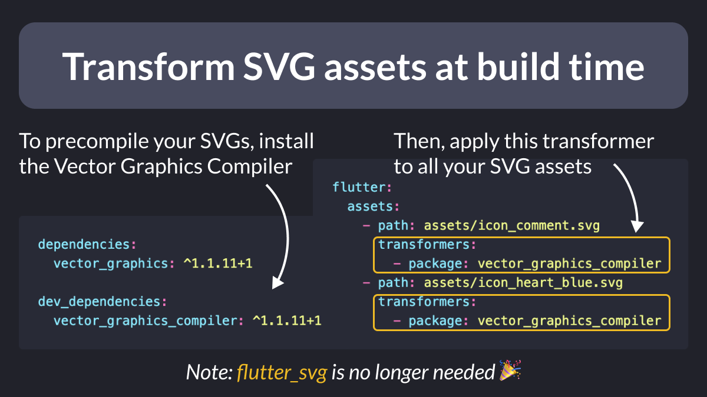
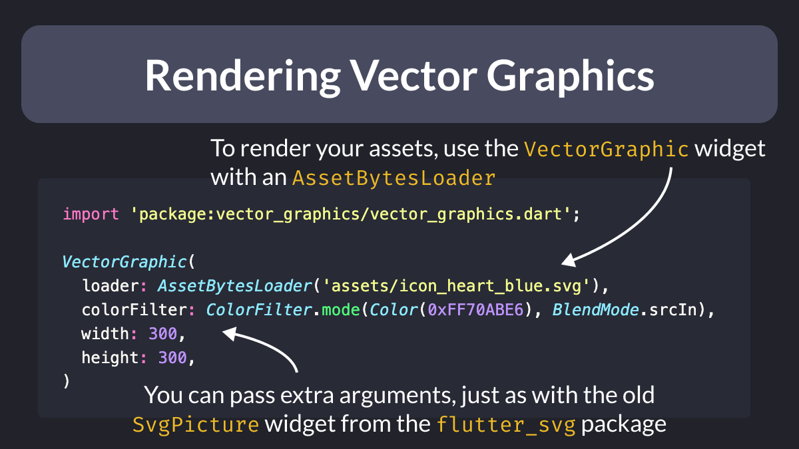

# Transform SVG assets at build time

Did you know?

With the Vector Graphics Compiler, you can precompile SVGs at build time for better rendering performance.

To do this, install the `vector_graphics_compiler` package and use it as a transformer for each of your SVG assets.

<!--
dependencies:
  vector_graphics: ^1.1.11+1

dev_dependencies:
  vector_graphics_compiler: ^1.1.11+1

flutter:
  assets:
    - path: assets/icon_comment.svg
      transformers:
        - package: vector_graphics_compiler
    - path: assets/icon_heart_blue.svg
      transformers:
        - package: vector_graphics_compiler
-->

---

Then, simply use a `VectorGraphic` widget with an `AssetBytesLoader` when you want to render your assets.

`VectorGraphic` acts as a replacement for the old `SvgPicture`, so you can pass the same arguments, too. 👍

<!--
import 'package:vector_graphics/vector_graphics.dart';

VectorGraphic(
  loader: AssetBytesLoader('assets/icon_heart_blue.svg'),
  colorFilter: ColorFilter.mode(Color(0xFF70ABE6), BlendMode.srcIn),
  width: 300,
  height: 300,
)
-->

---

For a demo of the new Vector Graphics Compiler, check out this free UI challenge on Code With Andrea Pro:

- [Twitter Embed Card: Challenge](https://pro.codewithandrea.com/flutter-ui-challenges/001-twitter-embed-card/01-intro)

---

Flutter 3.22 can do more than just precompiling SVGs:

✅ apply filters
✅ optimize PNGs

You can even create your own transformer packages.

For all the details, read the official docs:

- [Transforming assets at build time](https://docs.flutter.dev/ui/assets/asset-transformation)

---

| Previous | Next |
| -------- | ---- |
| [JsonCodable (Dart Macros experiment)](../0160-dart-macros-json-codable/index.md) |  |

<!-- TWITTER|https://x.com/biz84/status/1791392190716952636 -->
<!-- LINKEDIN|https://www.linkedin.com/posts/andreabizzotto_did-you-know-with-the-vector-graphics-compiler-activity-7197158879045054464-pp9p -->

