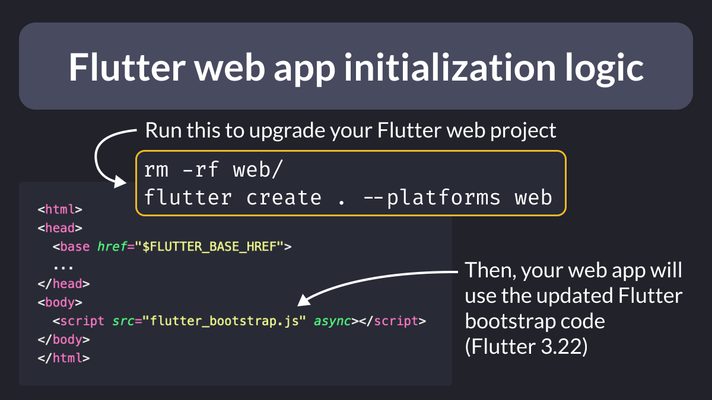
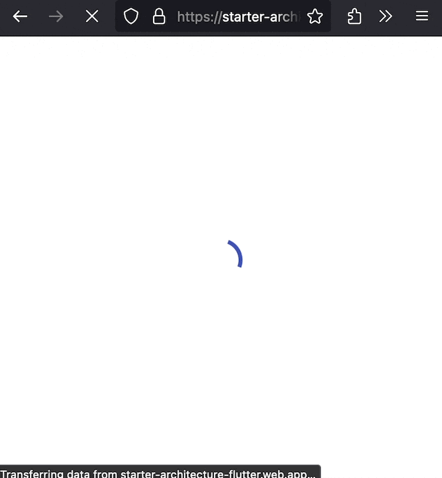

# Flutter Web App Initialization Logic with CSS Loader

Did you know?

Apps created with Flutter 3.22 use a new, faster web bootstrap process.

The easiest way to upgrade your existing apps is to delete the web folder and recreate it again with the Flutter CLI.

> Note: if you recreate the Flutter web project from scratch, remember to update your `index.html`, icons, and manifest files with whatever customizations you had before.

<!--

Run this to upgrade your Flutter web project:

rm -rf web/
flutter create . --platforms web

Then, your web app will use the updated Flutter bootstrap code
(Flutter 3.22):

<!DOCTYPE html>
<html>
<head>
  <base href="$FLUTTER_BASE_HREF">
  ...
</head>
<body>
  
</body>
</html>

-->

---

The new bootstrap process is quite customizable.

You can even display a CSS progress indicator before the Flutter app is ready to take over.

This gist shows how to accomplish this:

- [Custom Flutter Web App Initialization Logic with CSS Loader](https://gist.github.com/bizz84/08e6608cf7289a77c335e70122308857)

---

For all the details about the new app initialization process, read the official docs. 👇

- [Flutter web app initialization](https://docs.flutter.dev/platform-integration/web/bootstrapping)

---

| Previous | Next |
| -------- | ---- |
| [Transform SVG assets at build time](../0161-vector-graphics-compiler/index.md) | [Taking screenshots with the Flutter CLI](../0163-flutter-screenshot/index.md) |

<!-- TWITTER|https://x.com/biz84/status/1792839682688184433 -->
<!-- LINKEDIN|https://www.linkedin.com/posts/andreabizzotto_did-you-know-apps-created-with-flutter-activity-7198606765519687681-V9Se -->
