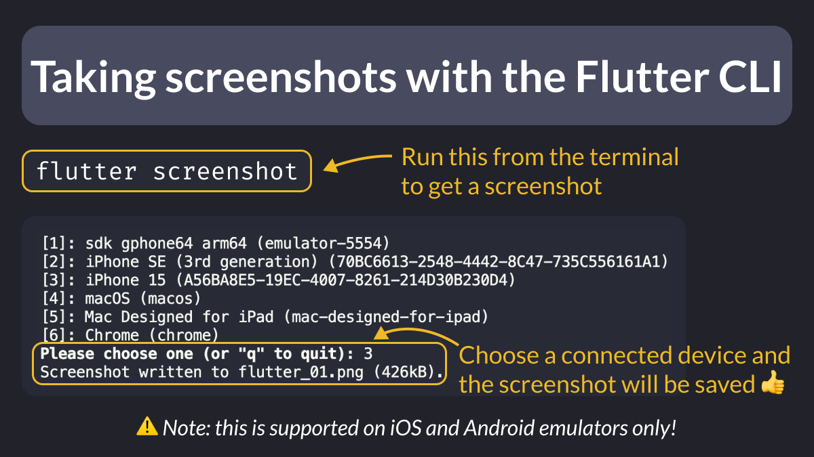

# Taking screenshots with the Flutter CLI

Did you know that you take screenshots with the Flutter CLI?

To do this, run `flutter screenshot` from the terminal. Then, choose a device, and the screenshot will be saved in the current directory.

Note: this works **only** on the iOS and Android emulators - other platforms and real devices are not supported.

<!--
flutter screenshot

[1]: sdk gphone64 arm64 (emulator-5554)
[2]: iPhone SE (3rd generation) (70BC6613-2548-4442-8C47-735C556161A1)
[3]: iPhone 15 (A56BA8E5-19EC-4007-8261-214D30B230D4)
[4]: macOS (macos)
[5]: Mac Designed for iPad (mac-designed-for-ipad)
[6]: Chrome (chrome)
Please choose one (or "q" to quit): 3
Screenshot written to flutter_01.png (426kB).

-->

---

Alternatively, simply hit **CMD+S** (on macOS) or **CTRL+S** (on Windows) from your iOS simulator or Android emulator to capture a screenshot.

---

| Previous | Next |
| -------- | ---- |
| [Flutter Web App Initialization Logic with CSS Loader](../0162-flutter-web-app-initialization-logic/index.md) | [The UniversalPlatform Package](../0164-universal-platform-package/index.md) |

<!-- TWITTER|https://x.com/biz84/status/1792839682688184433 -->
<!-- LINKEDIN|https://www.linkedin.com/posts/andreabizzotto_did-you-know-that-you-take-screenshots-with-activity-7204108295022788609-7A2p -->