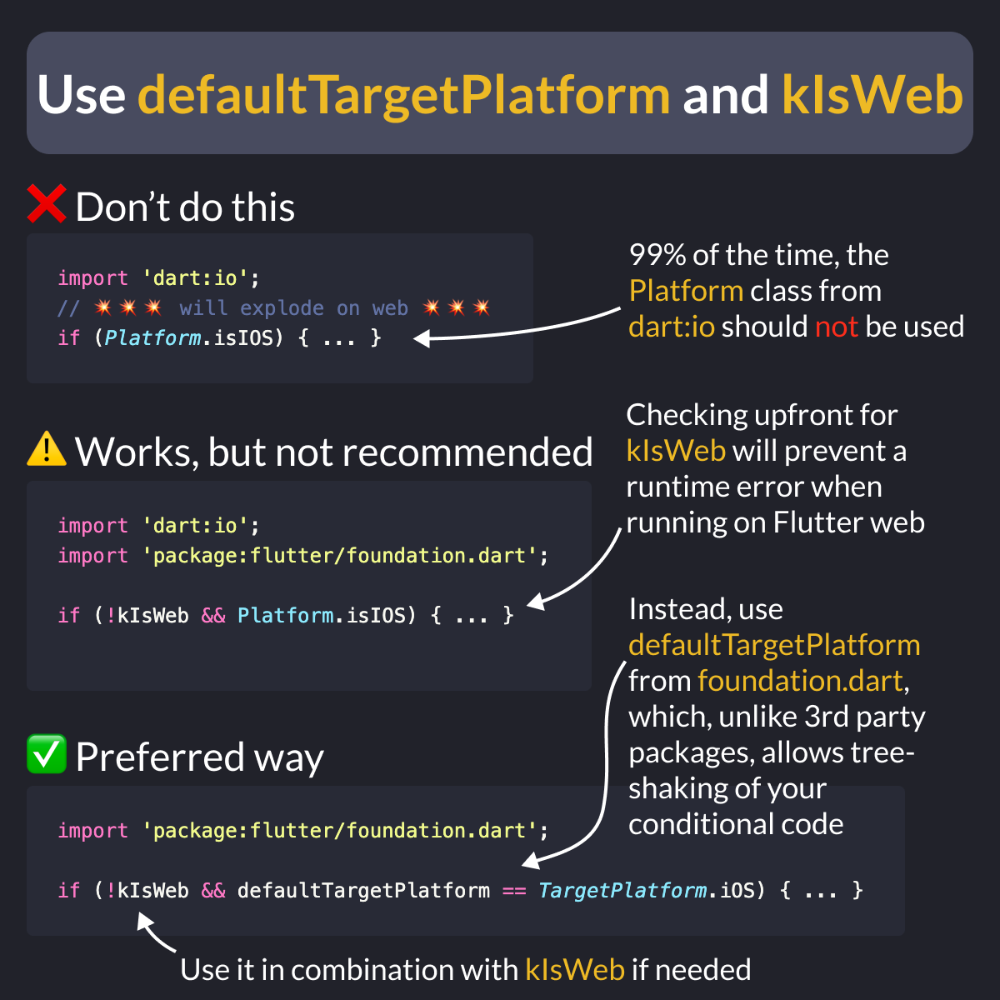

# Use defaultTargetPlatform and kIsWeb

Did you know?

If your code checks the current platform with [`Platform.isIOS`](https://api.flutter.dev/flutter/dart-io/Platform-class.html), you’ll get a runtime exception when you run on Flutter web. 💥

To prevent this, check for [`kIsWeb`](https://api.flutter.dev/flutter/foundation/kIsWeb-constant.html) beforehand and use it together with [`defaultTargetPlatform`](https://api.flutter.dev/flutter/foundation/defaultTargetPlatform.html), which doesn't import `dart:io`. 👍

<!--
// Use defaultTargetPlatform and kIsWeb

// Don't do this

import 'dart:io';
// 💥💥💥 will explode on web 💥💥💥
if (Platform.isIOS) { ... }

// Works, but not recommended
import 'dart:io';
import 'package:flutter/foundation.dart';

if (!kIsWeb && Platform.isIOS) { ... }

// Preferred way
import 'package:flutter/foundation.dart';

if (!kIsWeb && defaultTargetPlatform == TargetPlatform.iOS) { ... }
-->

---

### Why are kIsWeb and defaultTargetPlatform both needed?

According to the [docs](https://api.flutter.dev/flutter/foundation/defaultTargetPlatform.html):

- `kIsWeb` is a boolean which is true if the application is running on the web
- `defaultTargetPlatform` returns which platform the browser is running on

For a more detailed discussion about these APIs, read [this thread](https://x.com/biz84/status/1801525375060873701).

---

| Previous | Next |
| -------- | ---- |
| [The UniversalPlatform Package](../0164-universal-platform-package/index.md) | [Conditional Imports for Web/Native APIs](../0166-conditional-imports/index.md) |

<!-- TWITTER|https://x.com/biz84/status/1801161442118242783 -->
<!-- LINKEDIN|https://www.linkedin.com/posts/andreabizzotto_did-you-know-if-your-code-checks-the-current-activity-7206927597866266625-eptz -->