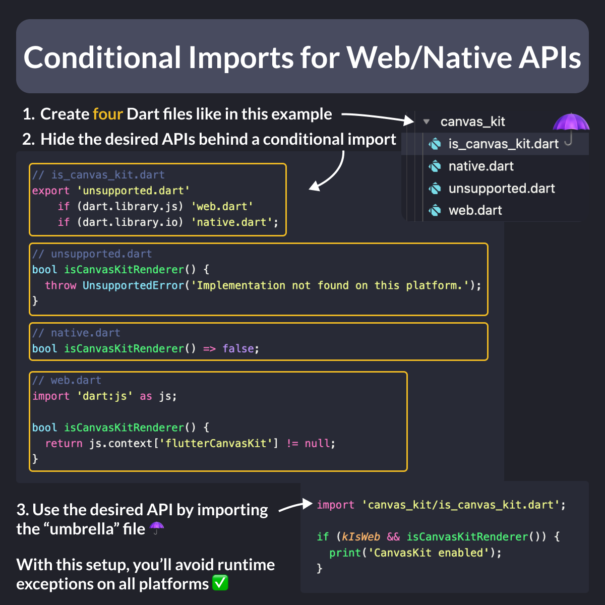

# Conditional Imports for Web/Native APIs

Did you know?

If you try to access a web-specific API on native platforms, your app will crash. 💥

To prevent this, hide your API behind an "umbrella" file using conditional imports. ✅

Here's an example showing how to check if the app is using the CanvasKit renderer. 👇

<!--
// is_canvas_kit.dart
export 'unsupported.dart'
    if (dart.library.js) 'web.dart'
    if (dart.library.ffi) 'native.dart';

// unsupported.dart
bool isCanvasKitRenderer() {
  throw UnsupportedError('Implementation not found on this platform.');
}

// native.dart
bool isCanvasKitRenderer() => false;

// web.dart
import 'dart:js' as js;

bool isCanvasKitRenderer() {
  return js.context['flutterCanvasKit'] != null;
}

// usage
if (kIsWeb && isCanvasKitRenderer()) {
  print('CanvasKit enabled');
}
-->

---

| Previous | Next |
| -------- | ---- |
| [Use defaultTargetPlatform and kIsWeb](../0165-default-target-platform/index.md) |  |

<!-- TWITTER|https://x.com/biz84/status/1803796875734090130 -->
<!-- LINKEDIN|https://www.linkedin.com/posts/andreabizzotto_did-you-know-if-you-try-to-access-a-web-specific-activity-7209562745543741441-9qCN -->