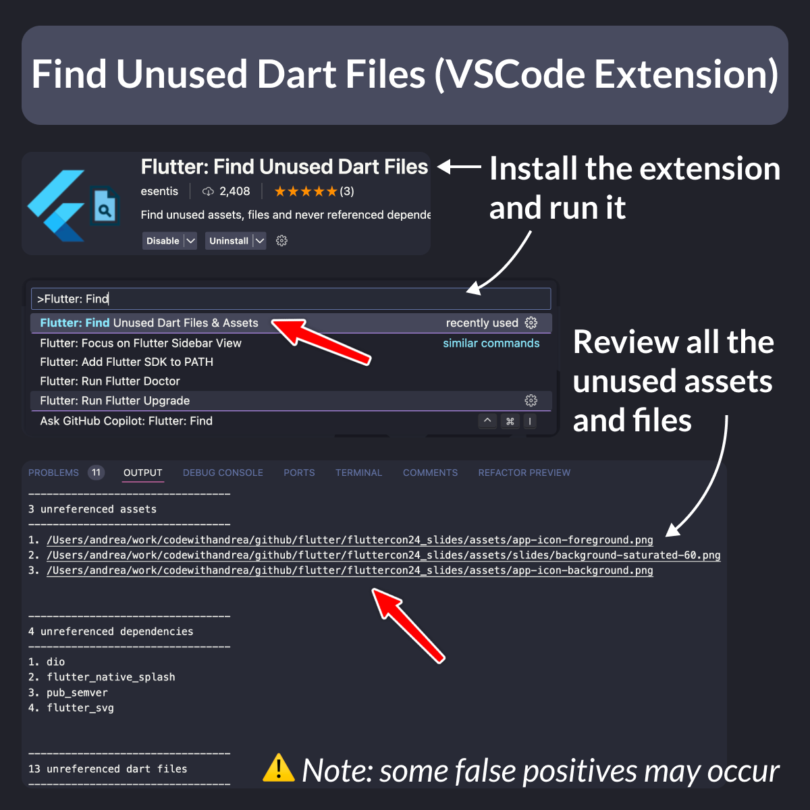

# Find Unused Dart Files (VSCode Extension)

Did you know?

Unused assets will increase your app bundle size, which is undesired.

To prevent this, you can install the "Find Unused Dart Files" extension for VSCode.

Then, simply run it from the command palette and review all the unused assets, files, and dependencies. 👌

<!--

Flutter: Find Unused Dart Files & Assets

A VSCode extension to find unused assets, files and never referenced dependencies to clean up your project.

-->

You can download the extension here:

- [Flutter: Find Unused Dart Files & Assets](https://marketplace.visualstudio.com/items?itemName=esentis.flutter-find-unused-assets-and-dart-files)

---

### Removing unused code via static analysis

**Note**: the extension works by finding references to the asset file names in your Dart code, and as such, it can produce false positives. So it's always best to check that they're actually unused before removing them.

If you want to reliably remove unused code and Dart files, consider using a static analysis tool like [DCM](https://dcm.dev/), which can detect and remove any [unused code](https://dcm.dev/blog/2024/01/09/whats-new-in-dcm-1-13-0/#unused-code-improvements) via `dcm fix` or from the IDE.

Happy coding!

---

| Previous | Next |
| -------- | ---- |
| [Conditional Imports for Web/Native APIs](../0166-conditional-imports/index.md) | [Disposing fields to avoid memory leaks](../0168-dispose-to-avoid-memory-leaks/index.md) |

<!-- TWITTER|https://x.com/biz84/status/1805221861170499798 -->
<!-- LINKEDIN|https://www.linkedin.com/posts/andreabizzotto_did-you-know-unused-assets-will-increase-activity-7210987699317452800-OkE_ -->
