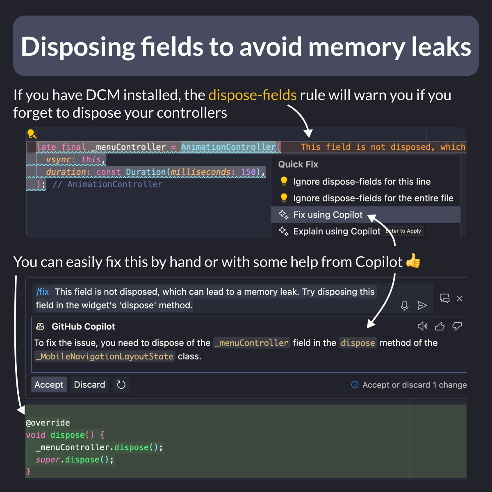

# Disposing fields to avoid memory leaks

Did you know?

Forgetting to dispose controllers in your `State` class can lead to memory leaks.

DCM has a handy "dispose-fields" rule that warns you about it.

And with a bit of help from Copilot, you can even fix this automatically. 👍



<!--
// If you have DCM installed, the dispose-fields rule will warn you if you forget to dispose your controllers
late final _menuController = AnimationController(
  vsync: this,
  duration: const Duration(milliseconds: 150),
);

// You can easily fix this by hand or with some help from Copilot
@override
void dispose() {
  _menuController.dispose();
  super.dispose();
}
-->

---

To get started with DCM, you can read the [Quick Start guide](https://dcm.dev/docs/quick-start/)

Once you've registered your license key and installed the VSCode extension or IntelliJ plugin, simply add this to your `analysis_options.yaml`, and you're good to go:

```yaml
dart_code_metrics:
  extends:
    - recommended
```

---

| Previous | Next |
| -------- | ---- |
| [Find Unused Dart Files (VSCode Extension)](../0167-find-unused-dart-files/index.md) |  |

<!-- TWITTER|https://x.com/biz84/status/1805971627437428950 -->
<!-- LINKEDIN|https://www.linkedin.com/posts/andreabizzotto_did-you-know-forgetting-to-dispose-an-animationcontroller-activity-7211737496328507393-Gmtu -->


