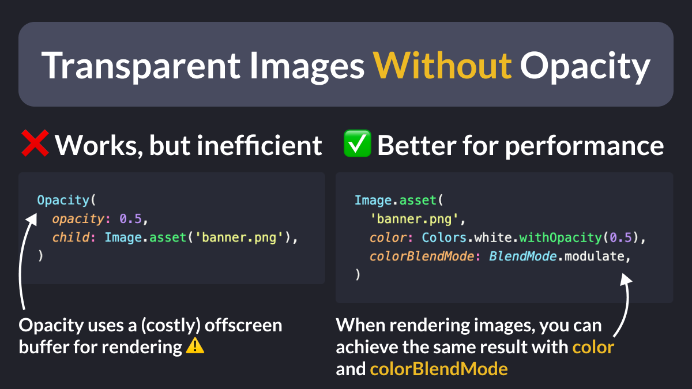

# Transparent Images With Opacity

If you need to show a semi-transparent image, use the `opacity` argument with `AlwaysStoppedAnimation` rather than adding a parent `Opacity` widget.

According to the docs, `Opacity` could apply the opacity to a group of widgets and therefore a costly offscreen buffer will be used.



<!--
// Transparent Images Without Opacity

// ❌ Works, but inefficient
// Opacity uses a (costly) offscreen buffer for rendering ⚠️
Opacity(
  opacity: 0.5,
  child: Image.asset('assets/banner.png'),
)

// ✅ Better for performance
Image.asset(
  'banner.png',
  opacity: const AlwaysStoppedAnimation(0.5),
)
-->

---

Note: the `Image` class also has `color` and `colorBlendMode` arguments that can be used to apply custom color filters:

```dart
// Same result as above
Image.asset(
  'assets/banner.png',
  color: Colors.white.withOpacity(0.5),
  colorBlendMode: BlendMode.modulate,
)
```

---

To learn more about the `Opacity` widget and its alternatives, read the official docs:

- [Opacity class](https://api.flutter.dev/flutter/widgets/Opacity-class.html)
- [Image.opacity property](https://api.flutter.dev/flutter/widgets/Image/opacity.html)
- [AlwaysStoppedAnimation class](https://api.flutter.dev/flutter/animation/AlwaysStoppedAnimation-class.html)

---

| Previous | Next |
| -------- | ---- |
| [Disposing fields to avoid memory leaks](../0168-dispose-to-avoid-memory-leaks/index.md) | [The build method: DOs and DON'Ts](../0170-build-method-do-dont/index.md) |


<!-- TWITTER|https://x.com/biz84/status/1806611989961085412 -->
<!-- LINKEDIN|https://www.linkedin.com/posts/andreabizzotto_take-2-if-you-need-to-show-a-semi-transparent-activity-7212378193616404481-zy4l -->


