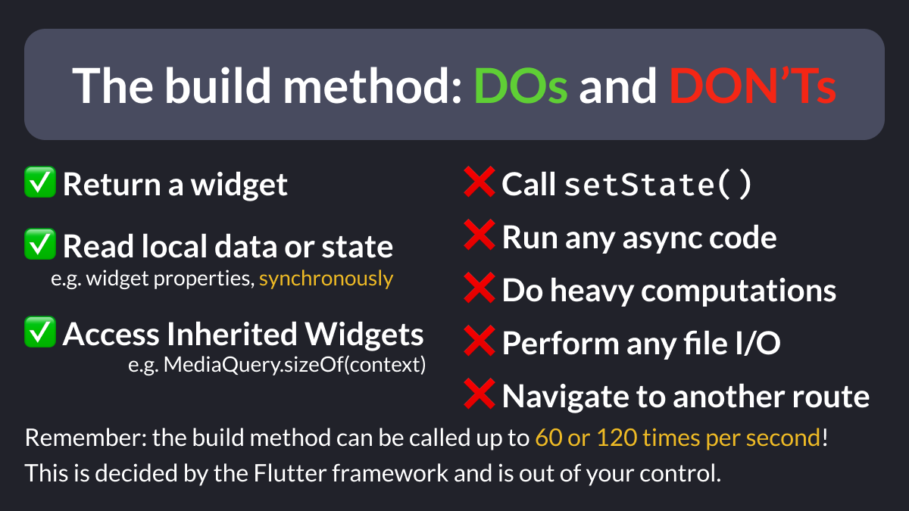
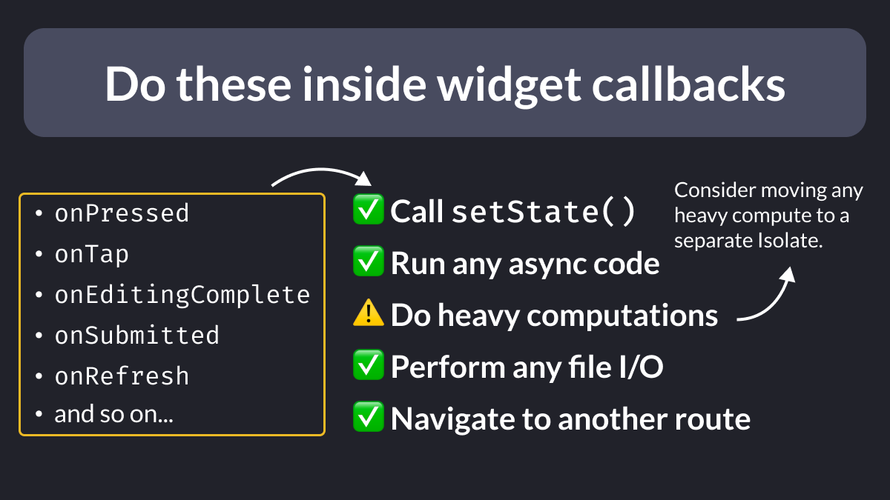

# The build method: DOs and DON'Ts

Did you know?

The widget `build` method can potentially be called in every frame and should **not** have any side effects.

Here's a list of DOs and DON'Ts. 👇

<!--
The build method: DOs and DON'Ts

✅ Return a widget
✅ Read local data or state (e.g. widget properties, synchronously)
✅ Access Inherited Widgets (e.g. MediaQuery.sizeOf(context))

❌ Call setState()
❌ Run any async code
❌ Do heavy computations
❌ Perform any file I/O
❌ Navigate to another route

Remember: the build method can be called up to 60 or 120 times per second!
This is decided by the Flutter framework and is out of your control.
-->

---

Conversely, you **can** run side effects inside widget callbacks, since these are triggered by separate events that are not part of the rendering phase.

<!--
Do these inside widget callbacks

- onPressed
- onTap
- onEditingComplete
- onSubmitted
- onRefresh
and so on...

✅ Call setState()
✅ Run any async code
⚠️ Do heavy computations
✅ Perform any file I/O
✅ Navigate to another route

Consider moving any heavy compute to a separate Isolate.

-->

---

I've written a complete article about side effects.

If you got this wrong before, it will help you. 👇

- [Side Effects in Flutter: What they are and how to avoid them](https://codewithandrea.com/articles/side-effects-flutter/)

---

| Previous | Next |
| -------- | ---- |
| [Transparent Images With Opacity](../0169-transparent-images-with-opacity/index.md) |  |

<!-- TWITTER|https://x.com/biz84/status/1806345326262890870 -->
<!-- LINKEDIN|https://www.linkedin.com/posts/andreabizzotto_did-you-know-the-widget-build-method-can-activity-7212111530044125185-6UcN -->

