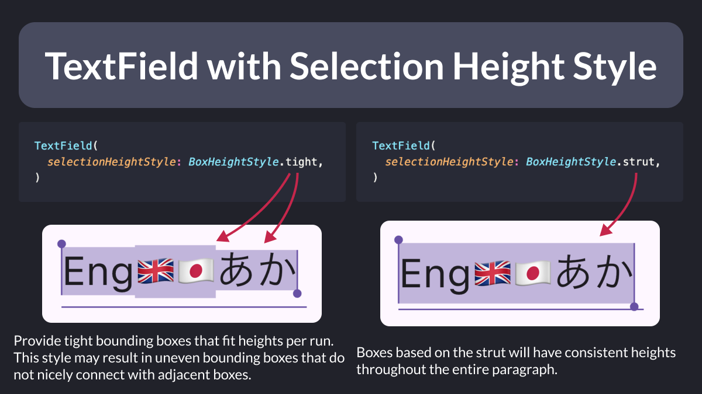

# TextField with Selection Height Style

Did you know?

You can use `BoxHeightStyle` to change the selection height style of a `TextField`.

This is quite useful in apps where you can enter emojis and text in multiple languages. 👌

<!--

TextField with Selection Height Style

TextField(
  selectionHeightStyle: BoxHeightStyle.tight,
)

Provide tight bounding boxes that fit heights per run. This style may result in uneven bounding boxes that do not nicely connect with adjacent boxes.

---

TextField(
  selectionHeightStyle: BoxHeightStyle.strut,
)

Boxes based on the strut will have consistent heights throughout the entire paragraph.

-->

---

To learn more, read the official docs:

- [TextField.selectionHeightStyle property](https://api.flutter.dev/flutter/material/TextField/selectionHeightStyle.html)

---

| Previous | Next |
| -------- | ---- |
| [The build method: DOs and DON'Ts](../0170-build-method-do-dont/index.md) |  |

<!-- TWITTER|https://x.com/biz84/status/1810657776525316263 -->
<!-- LINKEDIN|https://www.linkedin.com/feed/update/urn:li:activity:7216423635584987139/ -->

