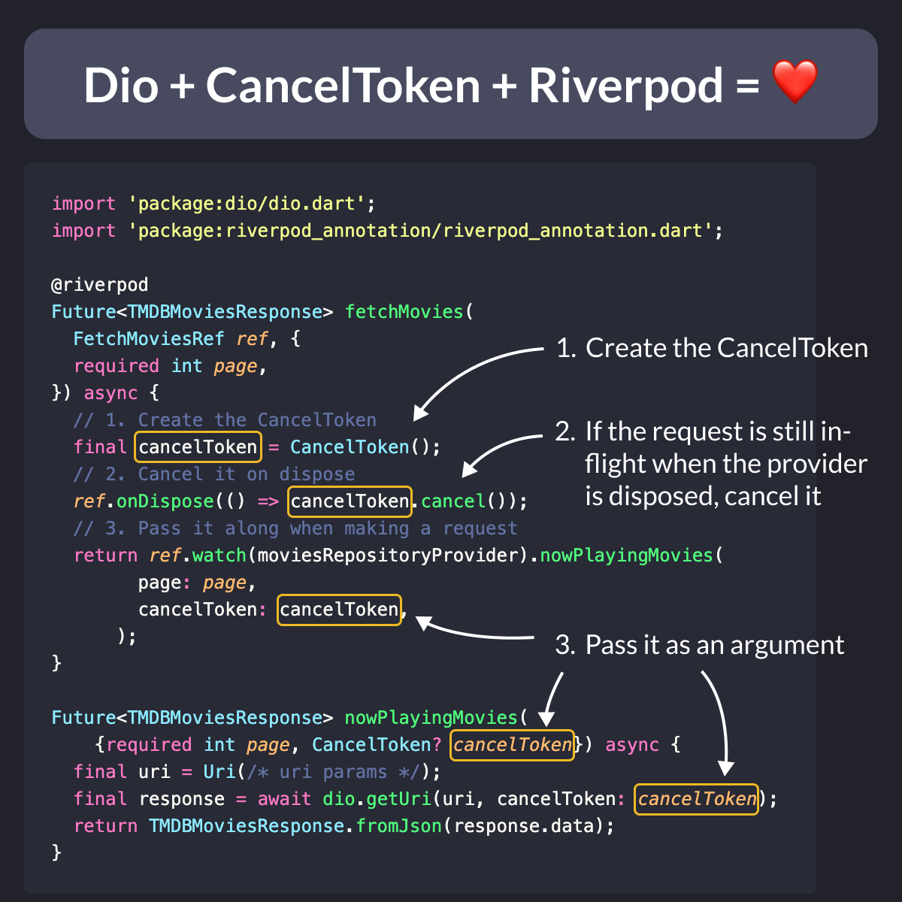

# Dio + CancelToken + Riverpod = ❤️

Did you know?

`CancelToken` lets you cancel HTTP requests on demand.

It's great for optimizing network usage, improving UX, and handling timeouts.

Use it to stop unnecessary data fetches when users navigate away or to implement "cancel" buttons in your Flutter apps.

<!--
import 'package:dio/dio.dart';
import 'package:riverpod_annotation/riverpod_annotation.dart';

@riverpod
Future<TMDBMoviesResponse> fetchMovies(
  FetchMoviesRef ref, {
  required int page,
}) async {
  // 1. Create the CancelToken
  final cancelToken = CancelToken();
  // 2. Cancel it on dispose
  ref.onDispose(() => cancelToken.cancel());
  // 3. Pass it along when making a request
  return ref.watch(moviesRepositoryProvider).nowPlayingMovies(
        page: page,
        cancelToken: cancelToken,
      );
}

Future<TMDBMoviesResponse> nowPlayingMovies(
    {required int page, CancelToken? cancelToken}) async {
  final uri = Uri(/* uri params */);
  final response = await dio.getUri(uri, cancelToken: cancelToken);
  return TMDBMoviesResponse.fromJson(response.data);
}
-->

---

`CancelToken` works great in combination with Riverpod. 

Here's a more in-depth example showing how to implement a caching-with-timeout strategy:

- [Caching with Timeout](https://codewithandrea.com/articles/flutter-riverpod-data-caching-providers-lifecycle/#caching-with-timeout)

---

| Previous | Next |
| -------- | ---- |
| [TextField with Selection Height Style](../0171-textfield-selection-height-style/index.md) |  |

<!-- TWITTER|https://x.com/biz84/status/1811393419643691340 -->
<!-- LINKEDIN|https://www.linkedin.com/posts/andreabizzotto_did-you-know-canceltoken-lets-you-cancel-activity-7217159479170084864-30p2  -->