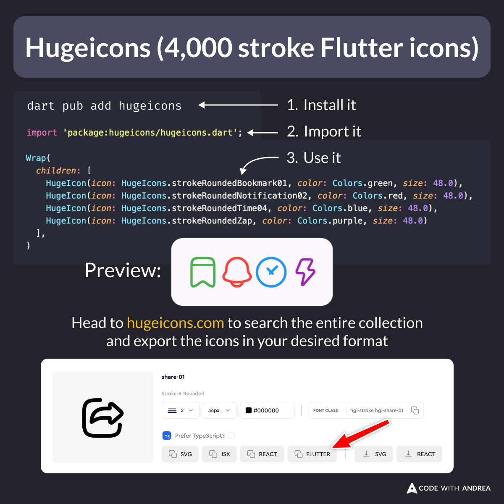

# Hugeicons (4,000 stroke Flutter icons)

Did you know?

The [hugeicons](https://pub.dev/packages/hugeicons) package was recently released, featuring a collection of over 4,000 stroke Flutter icons.

If you're looking for an alternative to the standard Material icons set, give it a go. 👍

<!--
To install, run: dart pub add hugeicons

import 'package:hugeicons/hugeicons.dart';

Wrap(
  children: [
    HugeIcon(icon: HugeIcons.strokeRoundedBookmark01, color: Colors.green, size: 48.0),
    HugeIcon(icon: HugeIcons.strokeRoundedNotification02, color: Colors.red, size: 48.0),
    HugeIcon(icon: HugeIcons.strokeRoundedTime04, color: Colors.blue, size: 48.0),
    HugeIcon(icon: HugeIcons.strokeRoundedZap, color: Colors.purple, size: 48.0)
  ],
)

Head to hugeicons.com to search the entire collection and export the icons in your desired format.
-->

---

| Previous | Next |
| -------- | ---- |
| [Dio + CancelToken + Riverpod = ❤️](../0172-dio-cancel-token-riverpod/index.md) |  |

<!-- TWITTER|https://x.com/biz84/status/1815306027568390349 -->
<!-- LINKEDIN|https://www.linkedin.com/posts/andreabizzotto_did-you-know-the-hugeicons-package-was-activity-7221071863290937344-shWZ  -->

