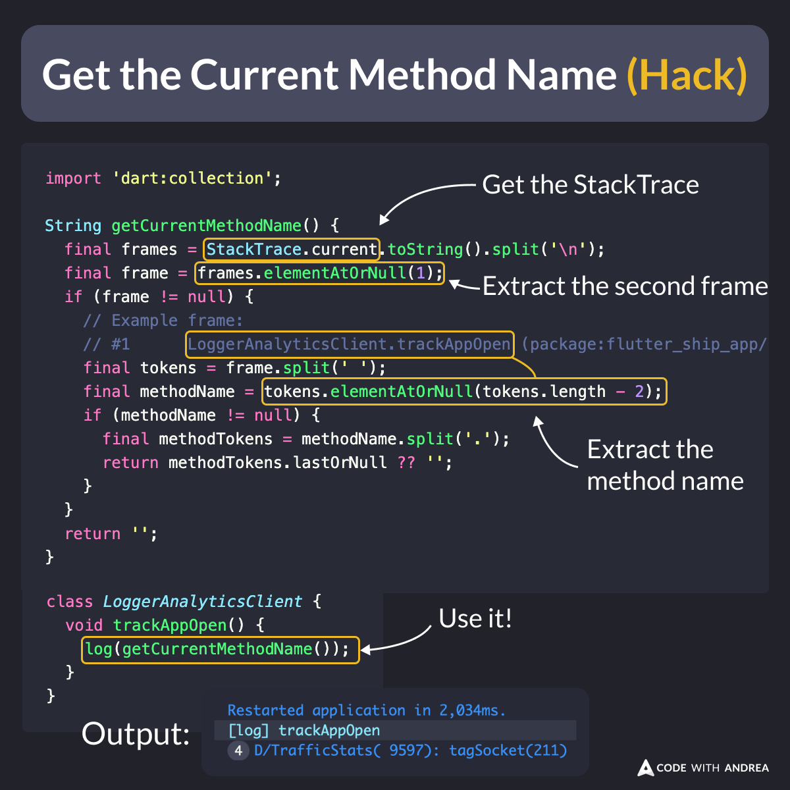

# Get the Current Method Name (Hack)

Did you know?

By doing some string manipulation on the current stack trace, you can extract the current method name.

This is useful with logging or analytics code, where similar methods may be invoked.

<!--

import 'dart:collection';

String getCurrentMethodName() {
  final frames = StackTrace.current.toString().split('\n');
  final frame = frames.elementAtOrNull(1);
  if (frame != null) {
    // Example frame:
    // #1      LoggerAnalyticsClient.trackAppOpen (package:flutter_ship_app/src/monitoring/logger_analytics_client.dart:28:9)
    final tokens = frame.split(' ');
    final methodName = tokens.elementAtOrNull(tokens.length - 2);
    if (methodName != null) {
      final methodTokens = methodName.split('.');
      return methodTokens.lastOrNull ?? '';
    }
  }
  return '';
}

class LoggerAnalyticsClient {
  void trackAppOpen() {
    log(getCurrentMethodName());
  }
}

// Output:
// Restarted application in 2,034ms.
// [log] trackAppOpen
// 4 D/TrafficStats( 9597): tagSocket(211)

-->

---

Note that this approach is a bit fragile and doesn't work well with extension methods or closures, where the stack frames look a bit different.

So, if you want to use it, make sure it's enabled only on debug builds. 

---

| Previous | Next |
| -------- | ---- |
| [Hugeicons (4,000 stroke Flutter icons)](../0173-hugeicons-flutter-stroke-icons/index.md) |  |

<!-- TWITTER|https://x.com/biz84/status/1815754159666176419 -->
<!-- LINKEDIN|https://www.linkedin.com/posts/andreabizzotto_did-you-know-by-doing-some-string-manipulation-activity-7221520196753133568-fGId  -->

