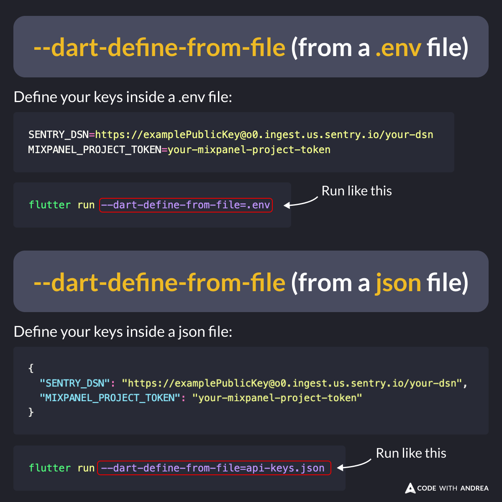
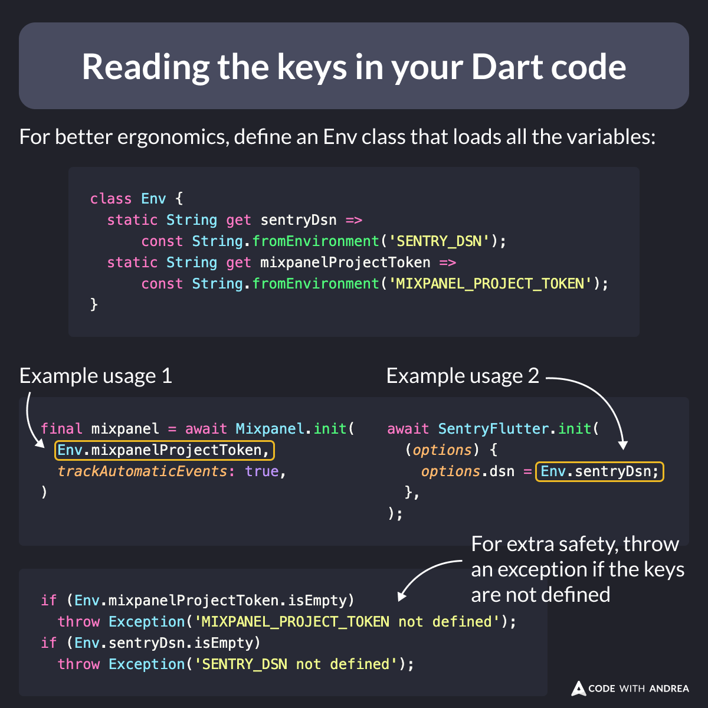

## How to use --dart-define-from-file with .env and json files

Did you know?

`--dart-define-from-file` supports both `.env` and `json` files.

Here's how to use it.



<!--

--dart-define-from-file (from a .env file)

Define your keys inside a .env file:

```
SENTRY_DSN=https://examplePublicKey@o0.ingest.us.sentry.io/your-dsn
MIXPANEL_PROJECT_TOKEN=your-mixpanel-project-token
```

Run like this:

```
flutter run --dart-define-from-file=.env
```

---

--dart-define-from-file (from a json file)

Define your keys inside a .json file:

```json
{
  "SENTRY_DSN": "https://examplePublicKey@o0.ingest.us.sentry.io/your-dsn",
  "MIXPANEL_PROJECT_TOKEN": "your-mixpanel-project-token"
}
```

Run like this:

```
flutter run --dart-define-from-file=api-keys.json
```

-->

---

Then, you can use `String.fromEnvironment` to read the keys in your Dart code.

For convenience, define an `Env` class that holds all the keys in one place. This makes it easier to use them.

Extra tip: when your app starts, throw an exception if the keys are not defined (this will help you catch any configuration errors):



<!--

// Reading the keys in your Dart code

// For better ergonomics, define an Env class that loads all the variables
class Env {
  static String get sentryDsn => const String.fromEnvironment('SENTRY_DSN');
  static String get mixpanelProjectToken =>
      const String.fromEnvironment('MIXPANEL_PROJECT_TOKEN');
}

// Example usage 1
final mixpanel = await Mixpanel.init(
  Env.mixpanelProjectToken,
  trackAutomaticEvents: true,
)

// Example usage 2
await SentryFlutter.init(
  (options) {
    options.dsn = Env.sentryDsn;
  },
);

// For extra safety, throw an exception if the keys are not defined
  if (Env.mixpanelProjectToken.isEmpty) {
    throw Exception('MIXPANEL_PROJECT_TOKEN not defined');
  }
  if (Env.sentryDsn.isEmpty) {
    throw Exception('SENTRY_DSN not defined');
  }
-->

---

| Previous | Next |
| -------- | ---- |
| [Get the Current Method Name (Hack)](../0174-get-method-name-stack-trace/index.md) | [Use unawaited for your analytics calls](../0176-use-unawaited-analytics-calls/index.md) |


<!-- TWITTER|https://x.com/biz84/status/1817917584932495809 -->
<!-- LINKEDIN|https://www.linkedin.com/posts/andreabizzotto_did-you-know-dart-define-from-file-supports-activity-7223683174126489600-cGMD -->
