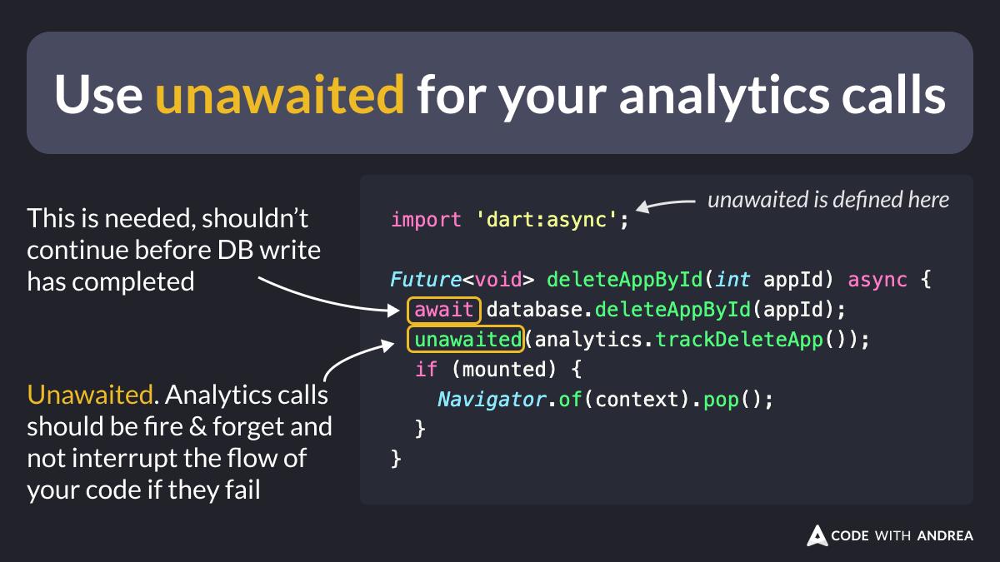

# Use unawaited for your analytics calls

When tracking analytics events in your code, consider using [unawaited](https://api.flutter.dev/flutter/dart-async/unawaited.html) from `dart:async`.

Why?

Analytics calls should be fire & forget and not interrupt the flow of your code if they fail.

By using `unawaited`, you make your intent more explicit.

<!--
// Use unawaited for your analytics calls
import 'dart:async';

Future<void> deleteAppById(int appId) async {
  await database.deleteAppById(appId);  
  unawaited(analytics.trackDeleteApp());
  if (mounted) {
    Navigator.of(context).pop();
  }
}
-->

For more info, read:

- [unawaited function](https://api.flutter.dev/flutter/dart-async/unawaited.html)

---

| Previous | Next |
| -------- | ---- |
| [How to use --dart-define-from-file with .env and json files](../0175-dart-define-from-file-env-json/index.md) | [log function args (dart:developer)](../0177-log-function-args/index.md) |

<!-- TWITTER|https://x.com/biz84/status/1818294816523870655 -->
<!-- LINKEDIN|https://www.linkedin.com/posts/andreabizzotto_take-2-when-tracking-analytics-events-activity-7224060927837384704-TPb4 -->