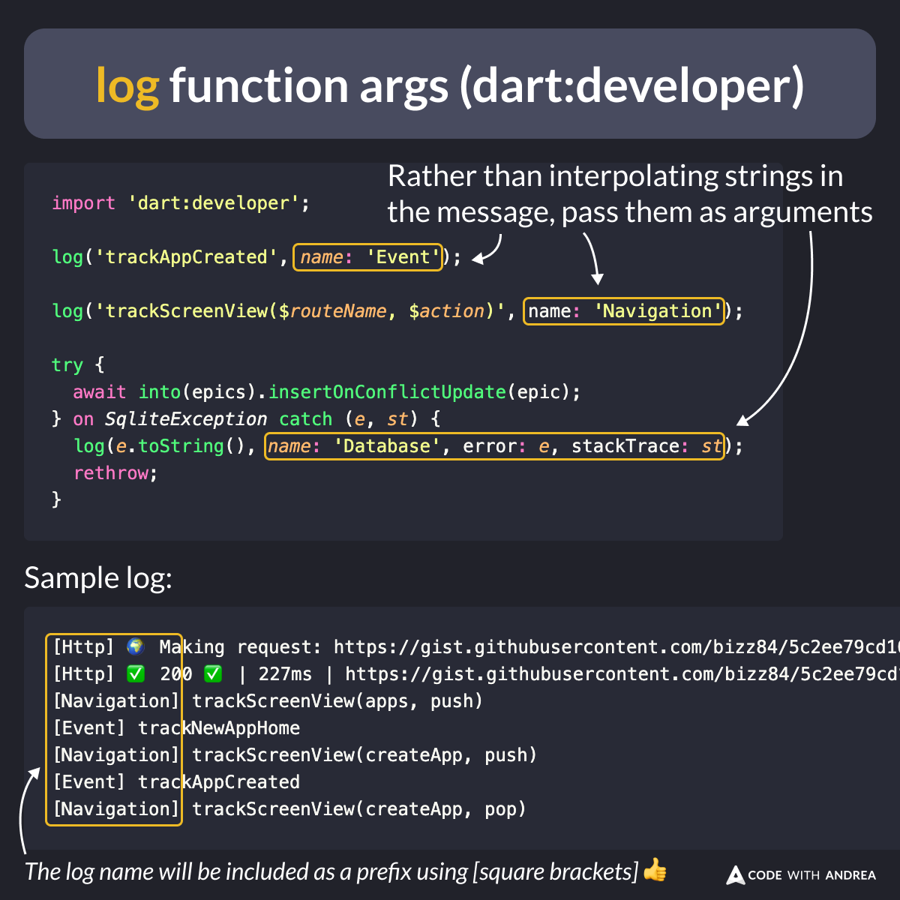

# Useful arguments in the log function (from dart:developer)

Did you know?

The humble [`log`](https://api.flutter.dev/flutter/dart-developer/log.html) function (from `dart:developer`) has many arguments that can be used to customize the appearance of your logs.

If you don't want to use a 3rd-party logger package, this is a pretty good way to go. 👍

<!--
// log function args (dart:developer)
import 'dart:developer';

// Rather than interpolating strings in the message, pass them as arguments
log('trackAppCreated', name: 'Event');

log('trackScreenView($routeName, $action)', name: 'Navigation');

try {
  await into(epics).insertOnConflictUpdate(epic);
} on SqliteException catch (e, st) {
  log(e.toString(), name: 'Database', error: e, stackTrace: st);
  rethrow;
}

Sample log

[Http] 🌍 Making request: https://gist.githubusercontent.com/bizz84/5c2ee79cd103bd43ce97b4d7fcfed103/raw/app_release_template.json
[Http] ✅ 200 ✅ | 227ms | https://gist.githubusercontent.com/bizz84/5c2ee79cd103bd43ce97b4d7fcfed103/raw/app_release_template.json
[Navigation] trackScreenView(apps, push)
[Event] trackNewAppHome
[Navigation] trackScreenView(createApp, push)
[Event] trackAppCreated
[Navigation] trackScreenView(createApp, pop)

The log name will be included as a prefix using [square brackets] 👍
-->

---

To learn about all the supported arguments, check the official docs:

- [log function](https://api.flutter.dev/flutter/dart-developer/log.html)

---

| Previous | Next |
| -------- | ---- |
| [Use unawaited for your analytics calls](../0176-use-unawaited-analytics-calls/index.md) |  |

<!-- TWITTER|https://x.com/biz84/status/1818615169108324603 -->
<!-- LINKEDIN|https://www.linkedin.com/posts/andreabizzotto_did-you-know-the-humble-log-function-activity-7224381117770956800-8mvt -->

