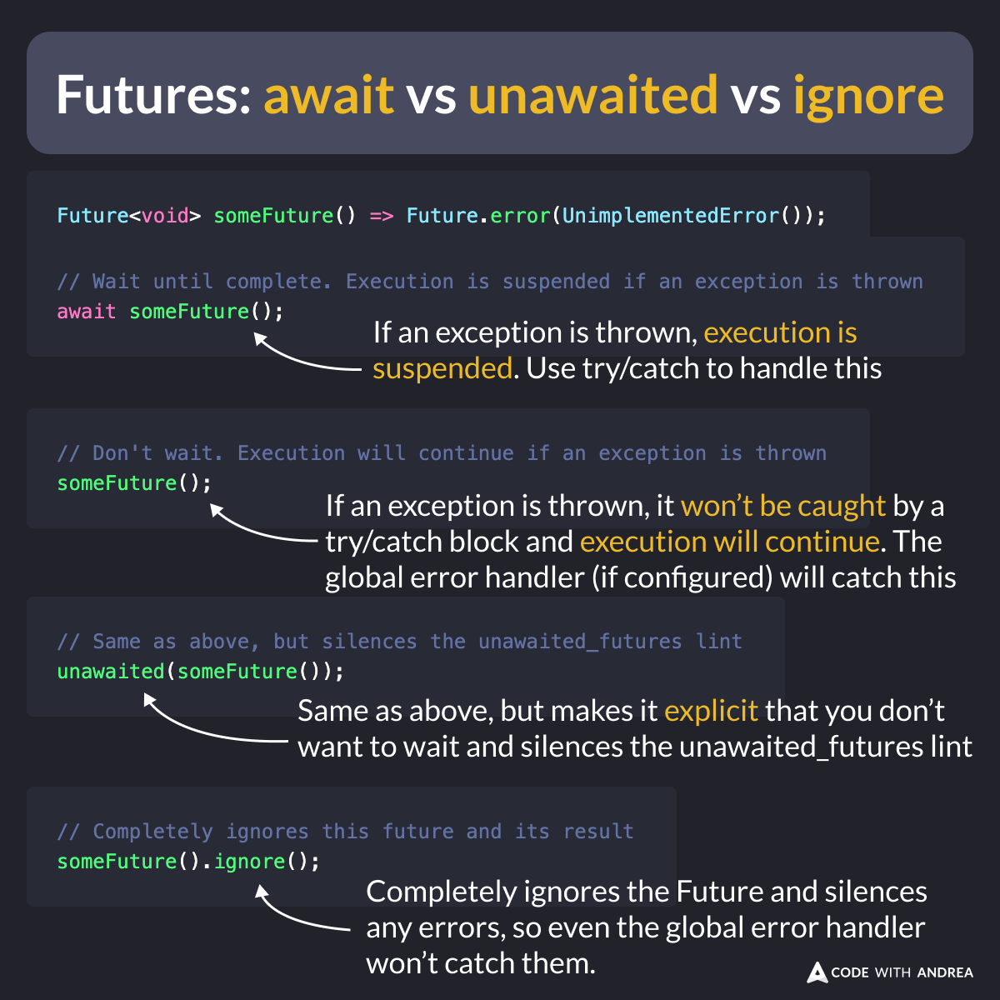

# Futures: await vs unawaited vs ignore

When you call a method that returns a Future, you have a decision to make:

- use await (most common)
- use unawaited
- use ignore

This decision affects how the code is executed when the Future throws, so make sure you understand each case well.

Here's an explanation. 👇



<!--
Future<void> someFuture() => Future.error(UnimplementedError());

// Wait until complete. Execution is suspended if an exception is thrown
await someFuture();

// Don't wait. Execution will continue if an exception is thrown
someFuture();

// Same as above, but silences the unawaited_futures lint
unawaited(someFuture());

// Completely ignores this future and its result
someFuture().ignore();
```
-->

Here are some resources where you can learn more:

- [Asynchrony support](https://dart.dev/language/async)
- [unawaited function](https://api.flutter.dev/flutter/dart-async/unawaited.html) and the [unawaited_futures lint](https://dart.dev/tools/linter-rules/unawaited_futures)
- [ignore method](https://api.flutter.dev/flutter/dart-async/FutureExtensions/ignore.html)

---

| Previous | Next |
| -------- | ---- |
| [Useful arguments in the log function (from dart:developer)](../0177-log-function-args/index.md) |  |