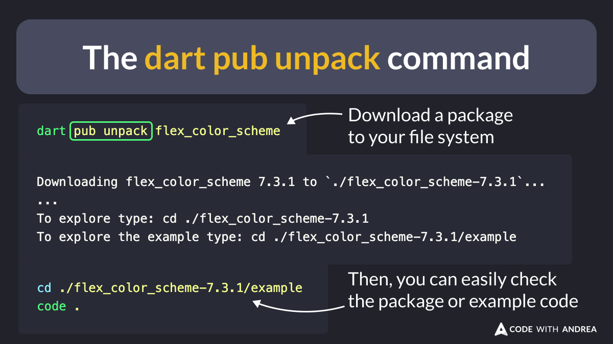

# The dart pub unpack command

Did you know?

As of Flutter 3.24, a new "pub unpack" command is available.

You can use it to download a package locally and easily explore its source code.

That's a nice quality-of-life improvement! 🎉

<!--
# How to run the pub unpack command
dart pub unpack flex_color_scheme

# Output:
Downloading flex_color_scheme 7.3.1 to `./flex_color_scheme-7.3.1`...
...
To explore type: cd ./flex_color_scheme-7.3.1
To explore the example type: cd ./flex_color_scheme-7.3.1/example

# Once done, you can explore its source code
cd ./flex_color_scheme-7.3.1/example
code .
-->

---

| Previous | Next |
| -------- | ---- |
| [The OverflowBar widget](../0179-overflowbar-widget/index.md) | [The CarouselView Widget](../0181-carousel-view-widget/index.md) |

<!-- TWITTER|https://x.com/biz84/status/1821128254402515382 -->
<!-- LINKEDIN|https://www.linkedin.com/posts/andreabizzotto_did-you-know-as-of-flutter-324-a-new-activity-7226894130767962112-R0Ns -->
