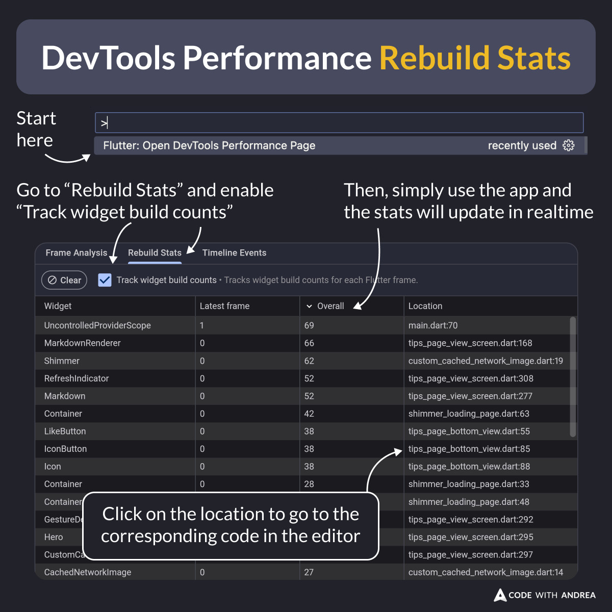

# DevTools Performance Rebuild Stats

Did you know?

Since Flutter 3.24, a new "Rebuild Stats" feature is available on the DevTools performance page.

Once you open it, simply use the app and the stats will update in realtime.

If you spot a widget that rebuilds too often, click on its location to go to the code.

<!--

DevTools Performance Rebuild Stats

- Open the DevTools Performance Page
- Go to "Rebuild Stats" and enable "Track widget build counts"
- Then, simply use the app and the stats will update in realtime
- Click on the location to go to the corresponding code in the editor

-->

---

| Previous | Next |
| -------- | ---- |
| [The CarouselView Widget](../0181-carousel-view-widget/index.md) |  |

<!-- TWITTER|https://x.com/biz84/status/1821815800774238532 -->
<!-- LINKEDIN|https://www.linkedin.com/posts/andreabizzotto_did-you-know-since-flutter-324-a-new-activity-7227581627386785792-_oTJ -->
