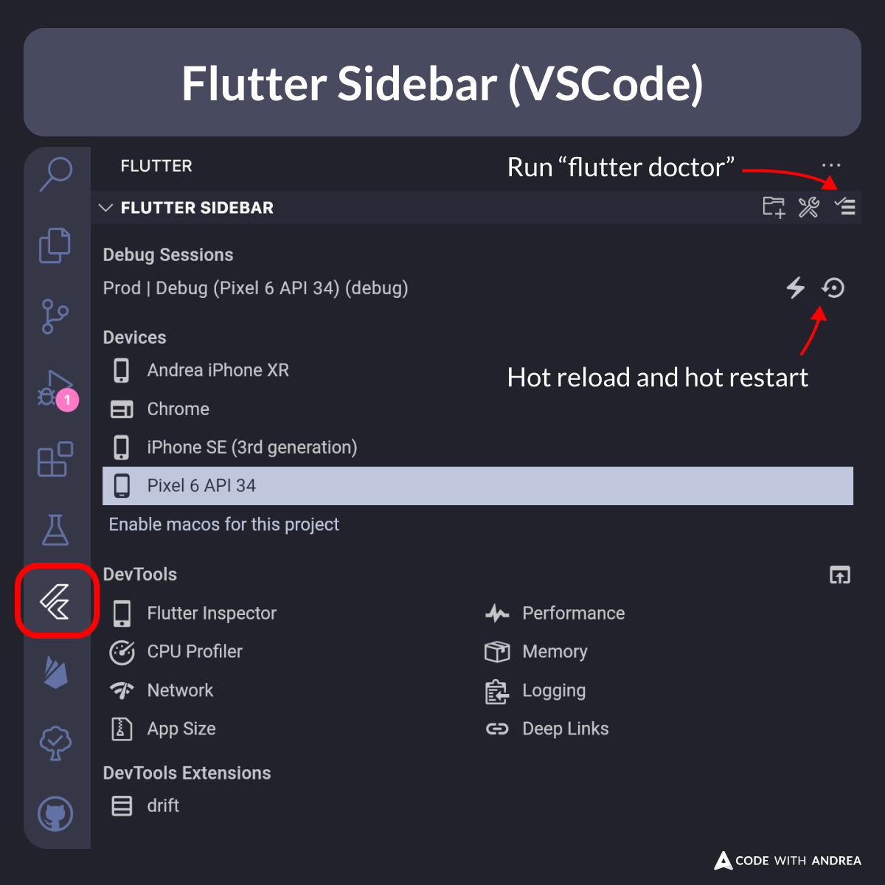

# Flutter Sidebar (VSCode)

Did you know?

You can use the Flutter VSCode sidebar to access the DevTools and other useful functionality.

The Flutter CLI and command palette can also be used for this, but it's nice to see everything in one place, just one click away.

<!--

With the Flutter VSCode sidebar, you can access:
- Debug Sessions
- Available devices
- DevTools and extensions

-->

---

| Previous | Next |
| -------- | ---- |
| [DevTools Performance Rebuild Stats](../0182-devtools-performance-rebuild-stats/index.md) | [How to build a TripleTapDetector](../0184-triple-tap-detector/index.md) |

<!-- TWITTER|https://x.com/biz84/status/1826934074088247722 -->
<!-- LINKEDIN|https://www.linkedin.com/posts/andreabizzotto_did-you-know-you-can-use-the-flutter-vscode-activity-7232699704688492545-eIoV -->

