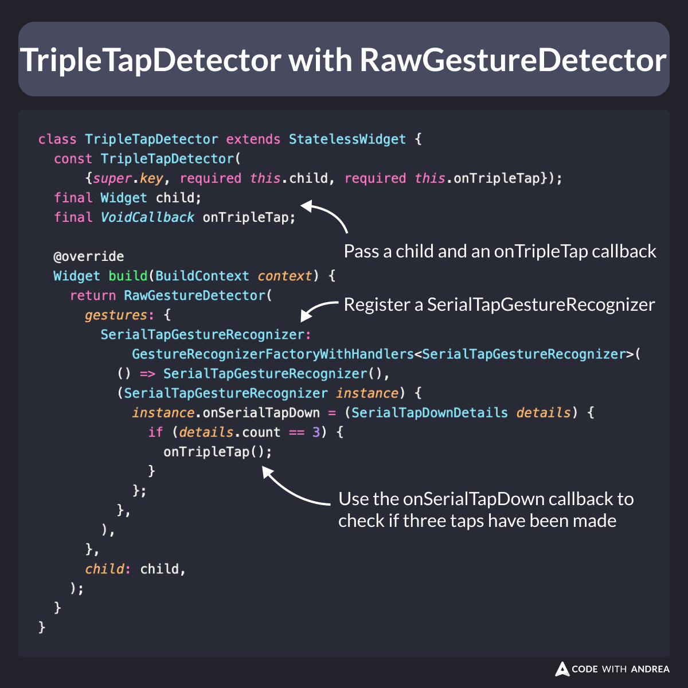

# Detect triple taps with RawGestureDetector

Have you ever wanted to detect a triple-tap gesture on your widgets?

`GestureDetector` doesn't support this, but can we create a `TripleTapDetector`?

Let's find out. 👇

<!--

GestureDetector has onTap and onDoubleTap callbacks, but onTripleTap does not exist.

But can we create a TripleTapDetector?

TripleTapDetector(
  onTripleTap: () => log('Easter egg 🐣'),
  child: Text('Psst... I\'m not just a Text'),
)

Let's find out.

-->

---

Thanks to `RawGestureDetector`, we can implement a `TripleTapDetector`.

Here's how it works:

- register a `SerialTapGestureRecognizer`
- use the `onSerialTapDown` callback
- check if three taps have been made

<!--
class TripleTapDetector extends StatelessWidget {
  const TripleTapDetector({
    super.key,
    required this.child,
    required this.onTripleTap,
  });
  final Widget child;
  final VoidCallback onTripleTap;

  @override
  Widget build(BuildContext context) {
    return RawGestureDetector(
      gestures: {
        SerialTapGestureRecognizer:
            GestureRecognizerFactoryWithHandlers<SerialTapGestureRecognizer>(
          () => SerialTapGestureRecognizer(),
          (SerialTapGestureRecognizer instance) {
            instance.onSerialTapDown = (SerialTapDownDetails details) {
              if (details.count == 3) {
                onTripleTap();
              }
            };
          },
        ),
      },
      child: child,
    );
  }
}
-->

---

This gist shows the full implementation.

- [https://gist.github.com/bizz84/0a57ad7afbe75353236943d30abf6cb0](https://gist.github.com/bizz84/0a57ad7afbe75353236943d30abf6cb0)

Feel free to reuse it in your projects. 🙂

---

| Previous | Next |
| -------- | ---- |
| [Flutter Sidebar (VSCode)](../0183-flutter-vscode-sidebar/index.md) | [Adding a Badge to an IconButton](../0185-add-badge-icon-button/index.md) |

<!-- TWITTER|https://x.com/biz84/status/1829091047902765184 -->
<!-- LINKEDIN|https://www.linkedin.com/posts/andreabizzotto_take-2-have-you-ever-wanted-to-detect-activity-7234857556442071040-5hDi  -->

