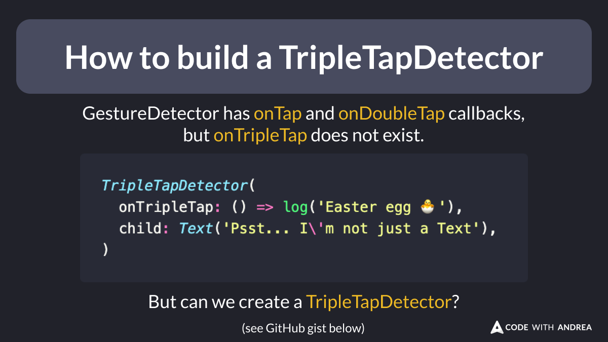

# How to build a TripleTapDetector

Have you ever wanted to detect a triple-tap gesture on your widgets?

`GestureDetector` doesn't support this, but can we create a `TripleTapDetector`?

See below for how to implement this. 👇

<!--

GestureDetector has onTap and onDoubleTap callbacks, but onTripleTap does not exist.

But can we create a TripleTapDetector?

TripleTapDetector(
  onTripleTap: () => log('Easter egg 🐣'),
  child: Text('Psst... I\'m not just a Text'),
)

Here's how to implement it:

https://gist.github.com/bizz84/0a57ad7afbe75353236943d30abf6cb0

-->

---

The main idea is to use a `StatefulWidget` with a `GestureDetector` and a `Timer`.

This way, we can reset the state after each successful triple tap or after the reset duration if fewer than three taps were detected.

This gist shows the full implementation:

- [https://gist.github.com/bizz84/0a57ad7afbe75353236943d30abf6cb0](https://gist.github.com/bizz84/0a57ad7afbe75353236943d30abf6cb0)

<!--
import 'package:flutter/material.dart';

class TripleTapDetector extends StatefulWidget {
  const TripleTapDetector({
    super.key,
    required this.child,
    required this.onTripleTap,
    this.resetDuration = const Duration(milliseconds: 500),
  });
  final Widget child;
  final VoidCallback onTripleTap;
  final Duration resetDuration;

  @override
  State<TripleTapDetector> createState() => _TripleTapDetectorState();
}

class _TripleTapDetectorState extends State<TripleTapDetector> {
  DateTime? _lastTapTime;
  int _tapCount = 0;
  Timer? _resetTimer;

  void _handleTap() {
    final now = DateTime.now();
    if (_lastTapTime != null &&
        now.difference(_lastTapTime!) < widget.resetDuration) {
      _tapCount++;
      if (_tapCount == 3) {
        widget.onTripleTap();
        _resetTapCount();
      }
    } else {
      _tapCount = 1;
    }
    _lastTapTime = now;
    _resetTimer?.cancel();
    _resetTimer = Timer(widget.resetDuration, _resetTapCount);
  }

  void _resetTapCount() {
    setState(() {
      _tapCount = 0;
      _lastTapTime = null;
    });
  }

  @override
  void dispose() {
    _resetTimer?.cancel();
    super.dispose();
  }

  @override
  Widget build(BuildContext context) {
    return GestureDetector(
      onTap: _handleTap,
      child: widget.child,
    );
  }
}
-->

---

| Previous | Next |
| -------- | ---- |
| [Flutter Sidebar (VSCode)](../0183-flutter-vscode-sidebar/index.md) |  |

<!-- TWITTER|https://x.com/biz84/status/1828444550865502544 -->
<!-- LINKEDIN|https://www.linkedin.com/posts/andreabizzotto_have-you-ever-wanted-to-detect-a-triple-tap-activity-7234210364018626560-WecR -->

