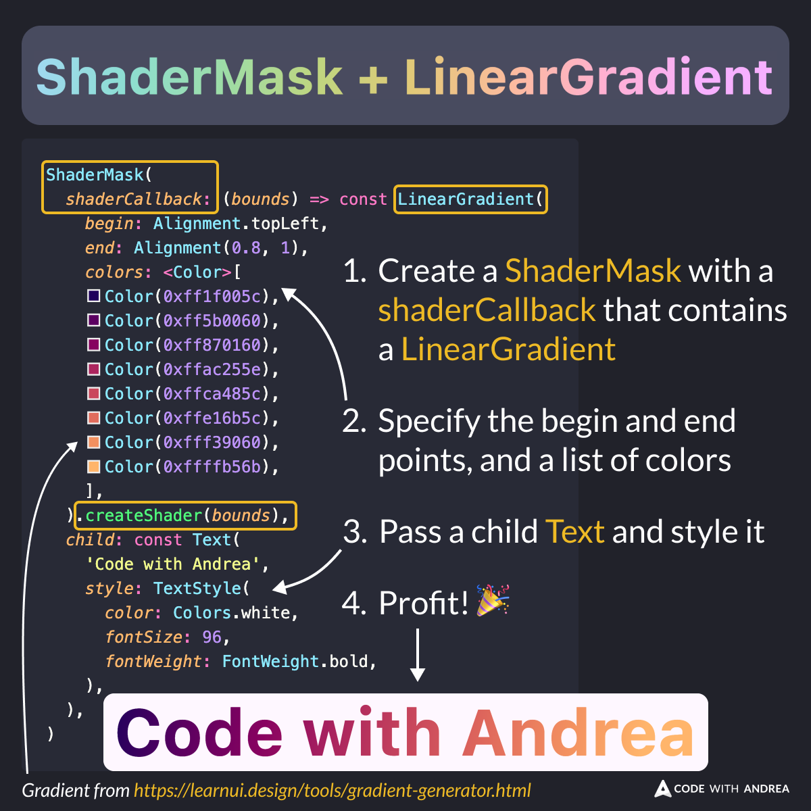

# ShaderMask + LinearGradient + Text = 🌈

Did you know?

You can create a stylish `Text` by combining a [ShaderMask](https://api.flutter.dev/flutter/widgets/ShaderMask-class.html) with a [LinearGradient](https://api.flutter.dev/flutter/painting/LinearGradient-class.html)! 🌈

Here's how to do it. 👇

<!--
To create a stylish Text, use the ShaderMask widget with a shaderCallback that contains a LinearGradient. Specify the begin and end points, along with a list of colors.

Example code:

ShaderMask(
  shaderCallback: (bounds) => const LinearGradient(
    begin: Alignment.topLeft,
    end: Alignment(0.8, 1),
    colors: <Color>[
      Color(0xff1f005c),
      Color(0xff5b0060),
      Color(0xff870160),
      Color(0xffac255e),
      Color(0xffca485c),
      Color(0xffe16b5c),
      Color(0xfff39060),
      Color(0xffffb56b),
    ],
  ).createShader(bounds),
  child: const Text(
    'Code with Andrea',
    style: TextStyle(
      color: Colors.white,
      fontSize: 96,
      fontWeight: FontWeight.bold,
    ),
  ),
)

-->

---

You can use this tool to generate the gradient colors:

- [Gradient Generator – CSS & SVG Export](https://www.learnui.design/tools/gradient-generator.html)

---

| Previous | Next |
| -------- | ---- |
| [Adding a Badge to an IconButton](../0185-add-badge-icon-button/index.md) |  |

<!-- TWITTER|https://x.com/biz84/status/1830935120489976219 -->
<!-- LINKEDIN|https://www.linkedin.com/posts/andreabizzotto_did-you-know-you-can-create-a-stylish-text-activity-7236700968883490818-g2Ff  -->

