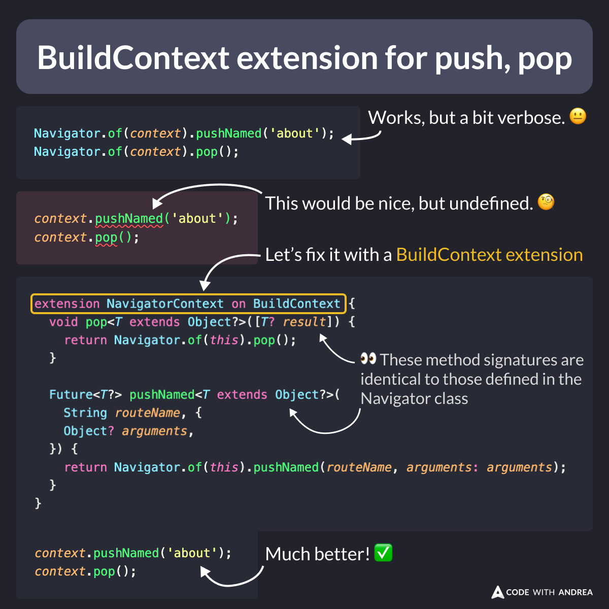

# BuildContext extension for push, pop

If your app still uses Navigator 1.0, calling `Navigator.of(context)` over and over gets a bit tiring.

To make your navigation code less verbose, define all the push/pop methods inside a `BuildContext` extension. ✅

Then, simply call `context.push` or `context.pop` as needed. 👇

<!--
// before
Navigator.of(context).pushNamed('about');
Navigator.of(context).pop();

// after
context.pushNamed('about');
context.pop();

// helper extension
extension NavigatorContext on BuildContext {
  void pop<T extends Object?>([T? result]) {
    return Navigator.of(this).pop();
  }

  Future<T?> pushNamed<T extends Object?>(
    String routeName, {
    Object? arguments,
  }) {
    return Navigator.of(this).pushNamed(routeName, arguments: arguments);
  }
}
-->

---

For more info, read:

- [Navigator class](https://api.flutter.dev/flutter/widgets/Navigator-class.html)
- [Extension methods](https://dart.dev/language/extension-methods)

---

| Previous | Next |
| -------- | ---- |
| [ShaderMask + LinearGradient + Text = 🌈](../0186-shader-mask-linear-gradient-text/index.md) | [Flutter DevTools Logging Page](../0188-flutter-devtools-logging-page/index.md) |

<!-- TWITTER|https://x.com/biz84/status/1831340712971096573 -->
<!-- LINKEDIN|https://www.linkedin.com/posts/andreabizzotto_if-your-app-still-uses-navigator-10-calling-activity-7237106548164988928-sDDC  -->

