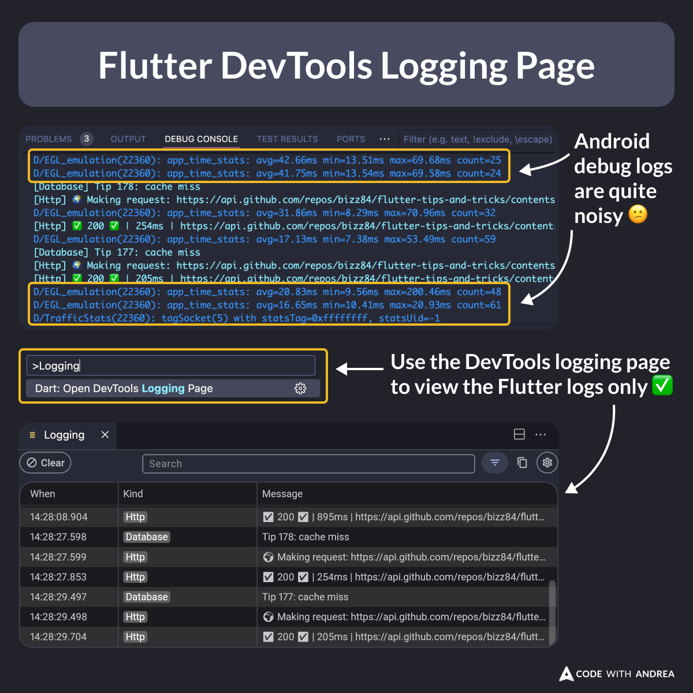

# Flutter DevTools Logging Page

When you run a Flutter app on the Android emulator, the debug logs can get quite noisy.

To work around it, open the DevTools logging page, which will only show the Flutter logs. ✅

<!-- 

A VSCode screenshot showing the difference between the debug console and the logging page, when running a Flutter app on the Android emulator.

-->

---

| Previous | Next |
| -------- | ---- |
| [BuildContext extension for push, pop](../0187-build-context-extension-push-pop/index.md) | [Adding a Navigator Observer](../0189-navigator-observer/index.md) |

<!-- TWITTER|https://x.com/biz84/status/1834230932322087334 -->
<!-- LINKEDIN|https://www.linkedin.com/posts/andreabizzotto_when-you-run-a-flutter-app-on-the-android-activity-7239996768401182721-IAa8  -->

