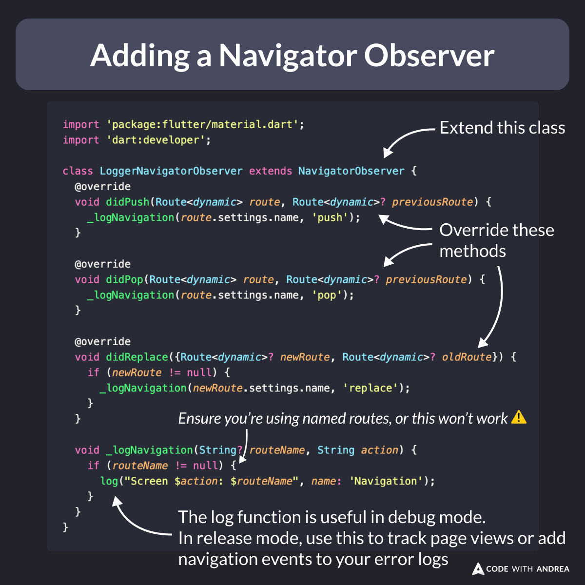
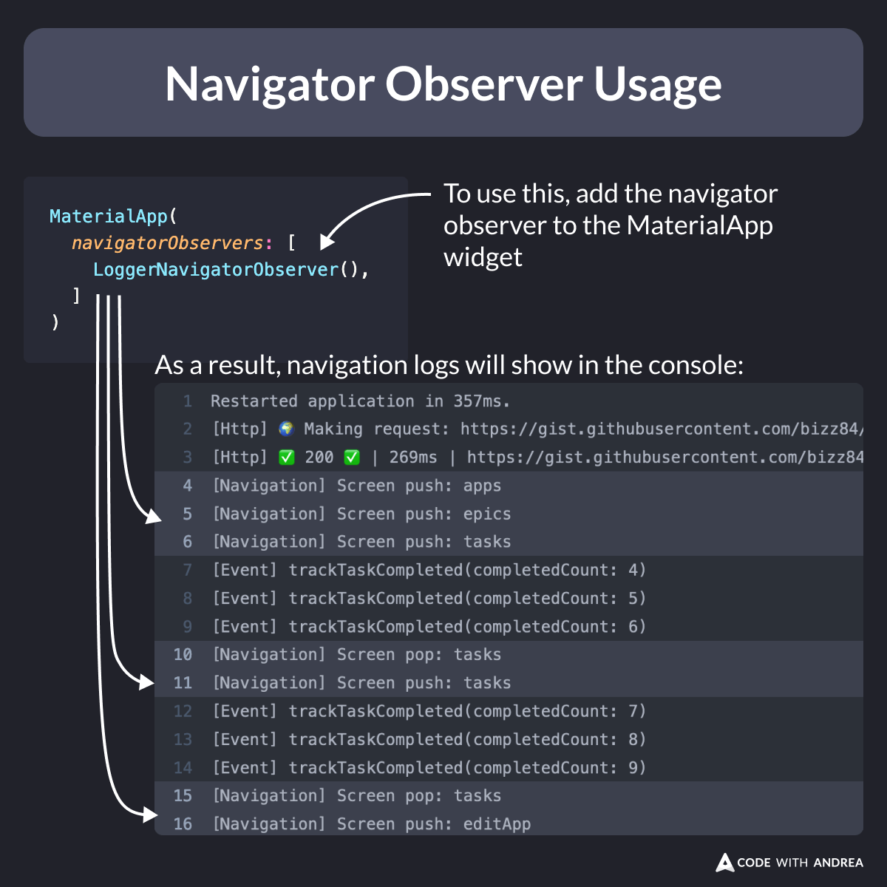

# Adding a Navigator Observer

Ever wanted to track page views or add navigation breadcrumbs to your error logs?

This can be done by implementing a `NavigatorObserver`. ✅

Here's some sample code showing how to implement this. 👇

---

<!--

import 'package:flutter/material.dart';
import 'dart:developer';

class LoggerNavigatorObserver extends NavigatorObserver {
  @override
  void didPush(Route<dynamic> route, Route<dynamic>? previousRoute) {
    _logNavigation(route.settings.name, 'push');
  }

  @override
  void didPop(Route<dynamic> route, Route<dynamic>? previousRoute) {
    _logNavigation(route.settings.name, 'pop');
  }

  @override
  void didReplace({Route<dynamic>? newRoute, Route<dynamic>? oldRoute}) {
    if (newRoute != null) {
      _logNavigation(newRoute.settings.name, 'replace');
    }
  }

  void _logNavigation(String? routeName, String action) {
    if (routeName != null) {
      log("Screen $action: $routeName", name: 'Navigation');
    }
  }
}
-->

---

To use the navigator observer, simply add it to the `MaterialApp` widget.

As a result, navigation logs will show in the console.

<!--

To use the navigator observer, simply add it to the MaterialApp widget.

As a result, navigation logs will show in the console.

MaterialApp(
  observers: [
    LoggerNavigatorObserver(),
  ]
)

-->

---

A couple of extra tips:

- some packages already offer a navigator observer (e.g. `SentryNavigatorObserver`), so you may not need to implement your own
- whatever you do, DON'T track page views on the `build` method (this can be called many times when widgets rebuild, and is out of your control)

---

I will cover analytics and error monitoring in detail in my upcoming course.

If you want to ship your apps with confidence, check it out and join the waitlist here:

- [Flutter in Production](https://codewithandrea.com/courses/flutter-in-production/)

---

| Previous | Next |
| -------- | ---- |
| [Flutter DevTools Logging Page](../0188-flutter-devtools-logging-page/index.md) |  |

<!-- TWITTER|https://x.com/biz84/status/1838145924943499701 -->
<!-- LINKEDIN|https://www.linkedin.com/posts/andreabizzotto_ever-wanted-to-track-page-views-or-add-navigation-activity-7243912852460171264-bd5M -->