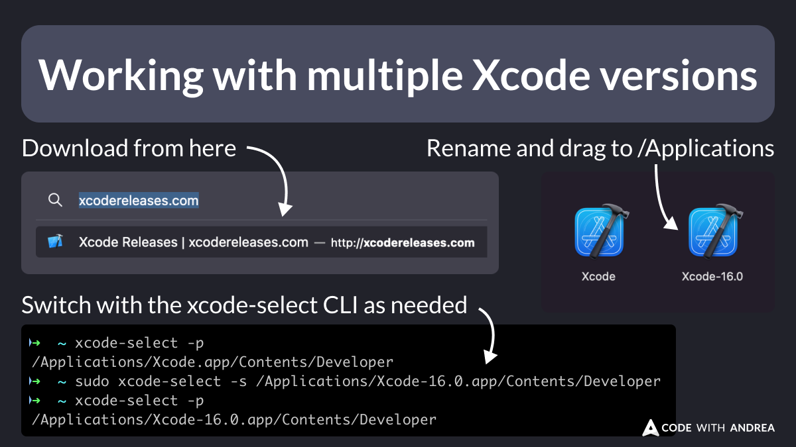

# Working with multiple Xcode versions

Did you know that you can install and use multiple Xcode versions?

Here's how:

- Head to [xcodereleases.com](https://xcodereleases.com) and download your desired release
- Extract and rename it
- Drag it to the `/Applications` folder

To switch between them, use the `xcode-select` CLI. 👇

<!--

➜  ~ xcode-select -p
/Applications/Xcode.app/Contents/Developer
➜  ~ sudo xcode-select -s /Applications/Xcode-16.0.app/Contents/Developer
➜  ~ xcode-select -p
/Applications/Xcode-16.0.app/Contents/Developer

-->

---

This can be useful if the latest release is *cough-cough* buggy, and you want to keep the old one around.

Or you just want to have multiple versions installed and easily switch between them.

---

Note that to use the `xcode-select` CLI, you will need to install the Xcode command line tools.

You can get them from here (sign-in required):

- [Command Line Tools for Xcode](https://developer.apple.com/download/all/?q=Command%20Line%20Tools%20for%20Xcode)

---

**Bonus**: If you want to manage multiple Xcode versions with a mouse click or through a CLI, you can download the `Xcodes` app:

- [Xcodes app](https://www.xcodes.app/)

---

| Previous | Next |
| -------- | ---- |
| [Adding a Navigator Observer](../0189-navigator-observer/index.md) | [Timing the In-App Review Prompt](../0191-timing-in-app-review-prompt/index.md) |

<!-- TWITTER|https://x.com/biz84/status/1838542156572606483 -->
<!-- LINKEDIN|https://www.linkedin.com/posts/andreabizzotto_did-you-know-that-you-can-install-and-use-activity-7244308116043894784-quRu -->

