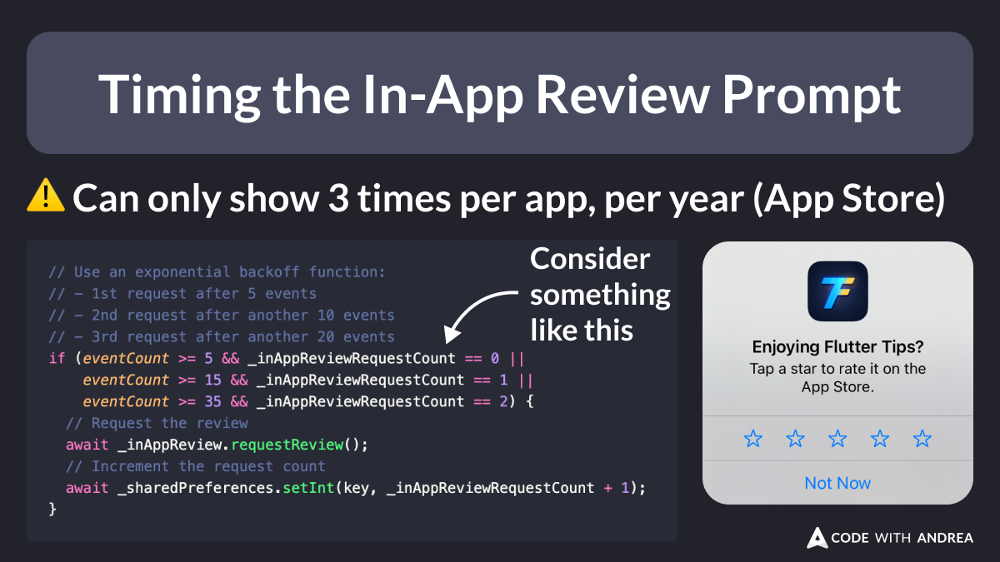

# Timing the In-App Review Prompt

Did you know?

The [in_app_review](https://pub.dev/packages/in_app_review) package makes it easy to ask for reviews in your app. ⭐️

But timing is key and the App Store will only let you show up to 3 prompts per year.

To avoid prompting users too early, track your desired event and only ask for a review after it is triggered N times.

<!--

// Use an exponential backoff function:
// - 1st request after 5 events
// - 2nd request after another 10 events
// - 3rd request after another 20 events
if (eventCount >= 5 && _inAppReviewRequestCount == 0 ||
    eventCount >= 15 && _inAppReviewRequestCount == 1 ||
    eventCount >= 35 && _inAppReviewRequestCount == 2) {
  // Request the review
  await _inAppReview.requestReview();
  // Increment the request count
  await _sharedPreferences.setInt(key, _inAppReviewRequestCount + 1);
}

-->

---

The code above only shows the main idea.

To learn more about in-app reviews, read:

- [How to Ask for In-App Reviews in Your Flutter App](https://codewithandrea.com/articles/flutter-in-app-review-prompt/)

---

| Previous | Next |
| -------- | ---- |
| [Working with multiple Xcode versions](../0190-multiple-xcode-versions/index.md) | [Async Stream Initialization with async*](../0192-async-stream-initialization/index.md) |

<!-- TWITTER|https://x.com/biz84/status/1839257930224324768 -->
<!-- LINKEDIN|https://www.linkedin.com/posts/andreabizzotto_did-you-know-the-inappreview-package-activity-7245023962869436417-K-pV -->

