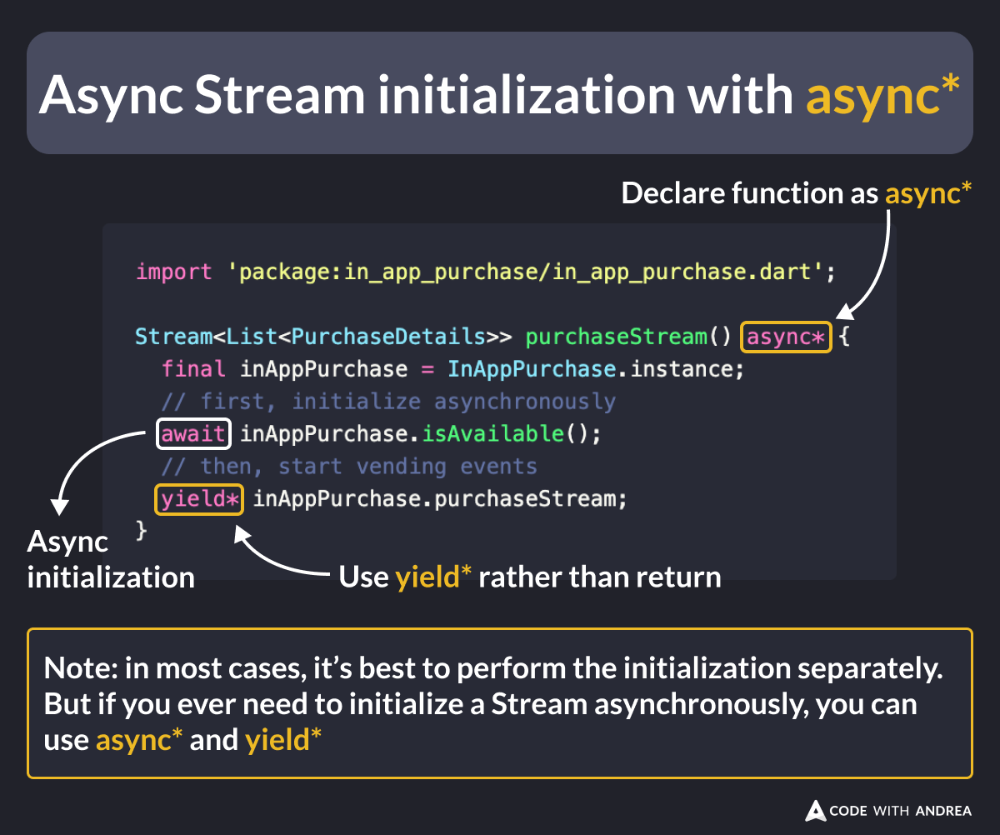

# Async Stream Initialization with async*

Did you know?

If you want to return a stream that depends on some asynchronous code, you can use `async*` and `yield*`.

This can be handy when you have an object that needs to be initialized asynchronously before it can start emitting events.

<!--
import 'package:in_app_purchase/in_app_purchase.dart';

Stream<List<PurchaseDetails>> purchaseStream() async* {
  final inAppPurchase = InAppPurchase.instance;
  // first, initialize asynchronously
  await inAppPurchase.isAvailable();
  // then, start vending events
  yield* inAppPurchase.purchaseStream;
}

Note: in most cases, it’s best to perform the initialization separately. But if you ever need to initialize a Stream asynchronously, you can use async* and yield*

-->

---

| Previous | Next |
| -------- | ---- |
| [Timing the In-App Review Prompt](../0191-timing-in-app-review-prompt/index.md) | [Control the Code Generation Order](../0193-control-codegen-order/index.md) |

<!-- TWITTER|https://x.com/biz84/status/1841128311163949163 -->
<!-- LINKEDIN|https://www.linkedin.com/posts/andreabizzotto_did-you-know-if-you-want-to-return-a-stream-activity-7246894142784434178-cYZ_ -->

