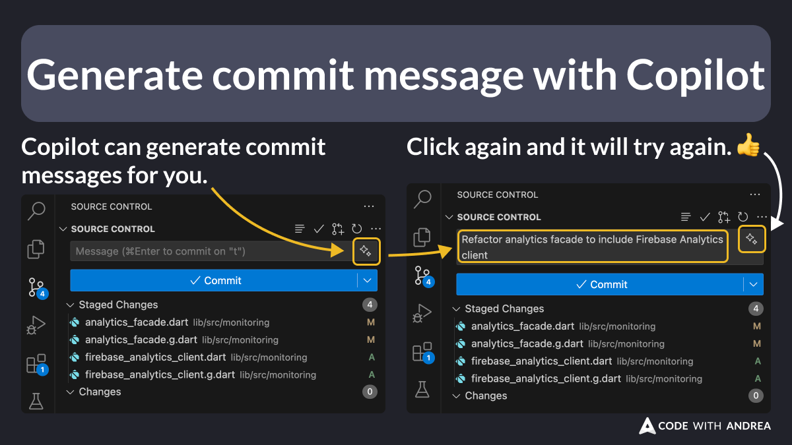

# Generate Commit Messages with Copilot

Did you know that [GitHub Copilot](https://github.com/features/copilot) can generate commit messages for you?

If you're not too picky about how you write your commit messages, this can be a neat little time saver!

<!--

From the source control panel, click on the ✨ icon and Copilot will generate the commit message for you.

Click again and it will try again. 👍

-->

---

Check this article for more Copilot tips and tricks:

- [GitHub Copilot: Tips and Tricks for Flutter Devs](https://codewithandrea.com/articles/github-copilot-tips-for-flutter-devs/)

---

| Previous | Next |
| -------- | ---- |
| [Control the Code Generation Order](../0193-control-codegen-order/index.md) |  |

<!-- TWITTER|https://x.com/biz84/status/1843558081504129358 -->
<!-- LINKEDIN|https://www.linkedin.com/posts/andreabizzotto_did-you-know-that-copilot-can-generate-commit-activity-7249323993650925569-WxJT -->

