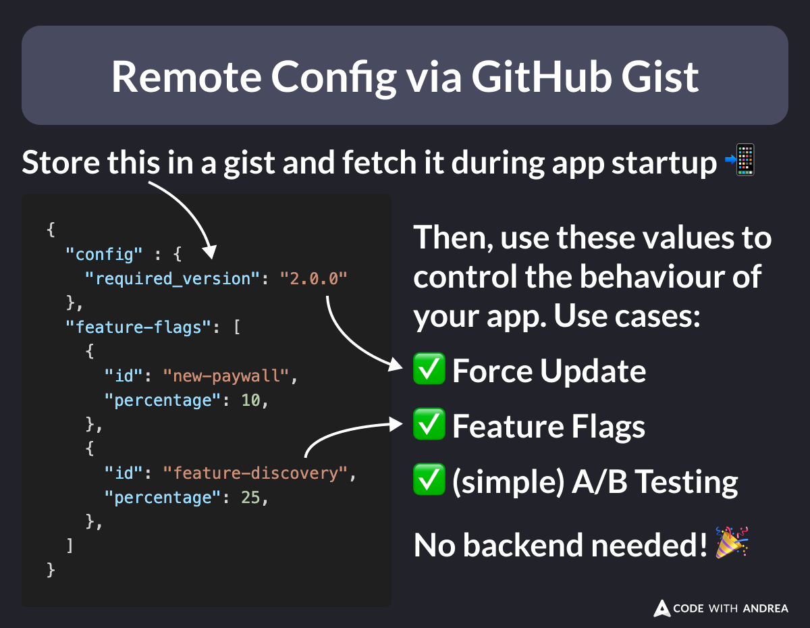

# Remote Config via GitHub Gist

Did you know?

You can remotely control the behaviour of your app by fetching some JSON from a GitHub gist (no Firebase or custom backend needed!)

This is super useful when implementing:

✅ Force update
🚩 Feature flags
🧪 A/B testing

<!--
{
  "config" : {
    "required_version": "2.0.0"
  },
  "feature-flags": [
    {
      "id": "new-paywall",
      "percentage": 10,
    },
    {
      "id": "feature-discovery",
      "percentage": 25,
    },
  ]
}
-->

I cover this in more detail in my latest course: Flutter in Production.

Check it out here and take advantage of my launch sale (currently 50% off!) 👇

https://codewithandrea.com/courses/flutter-in-production/