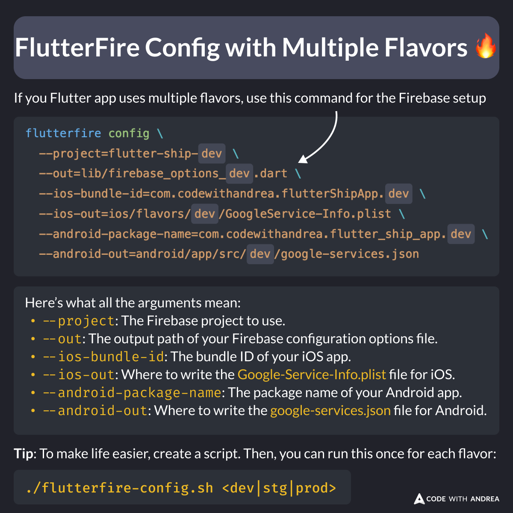

# FlutterFire Config with Multiple Flavors  (Shell Script)

Did you know?

If your Flutter app uses multiple flavors, you can use the FlutterFire CLI to generate the config files for each flavor.

**Pro tip**: create a bash script that takes the flavor as an argument, and run it when needed.

<!--

If you Flutter app uses multiple flavors, use this command for the Firebase setup

flutterfire config \
  --project=flutter-ship-dev \
  --out=lib/firebase_options_dev.dart \
  --ios-bundle-id=com.codewithandrea.flutterShipApp.dev \
  --ios-out=ios/flavors/dev/GoogleService-Info.plist \
  --android-package-name=com.codewithandrea.flutter_ship_app.dev \
  --android-out=android/app/src/dev/google-services.json

Here’s what all the arguments mean:
--project: The Firebase project to use.
--out: The output path of your Firebase configuration options file.
--ios-bundle-id: The bundle ID of your iOS app.
--ios-out: Where to write the Google-Service-Info.plist file for iOS.
--android-package-name: The package name of your Android app.
--android-out: Where to write the google-services.json file for Android.

Tip: To make life easier, create a script. Then, you can run this once for each flavor:

./flutterfire-config.sh <dev|stg|prod>
-->

---

This is only a small part of the Flutter app flavoring process.

For all the details, check my latest course. 👇

- [Flutter in Production](https://codewithandrea.com/courses/flutter-in-production/)
