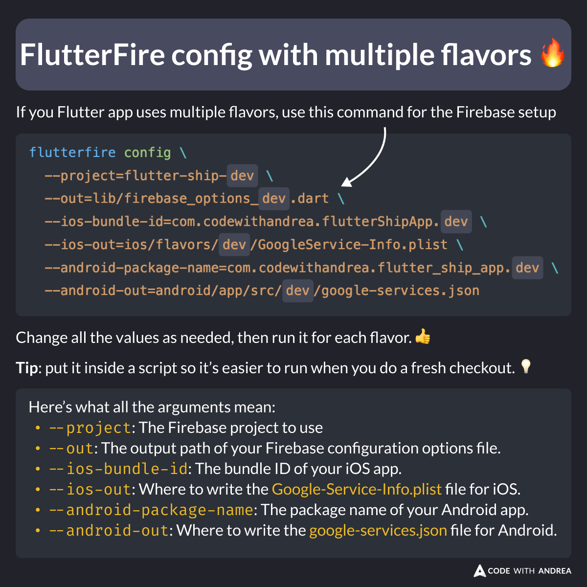

# FlutterFire Config with Multiple Flavors

Did you know?

If your Flutter app uses multiple flavors, you can use the FlutterFire CLI to generate the config files for each flavor.

Pro tip: create a bash script that takes the flavor as an argument, and run that when needed.

