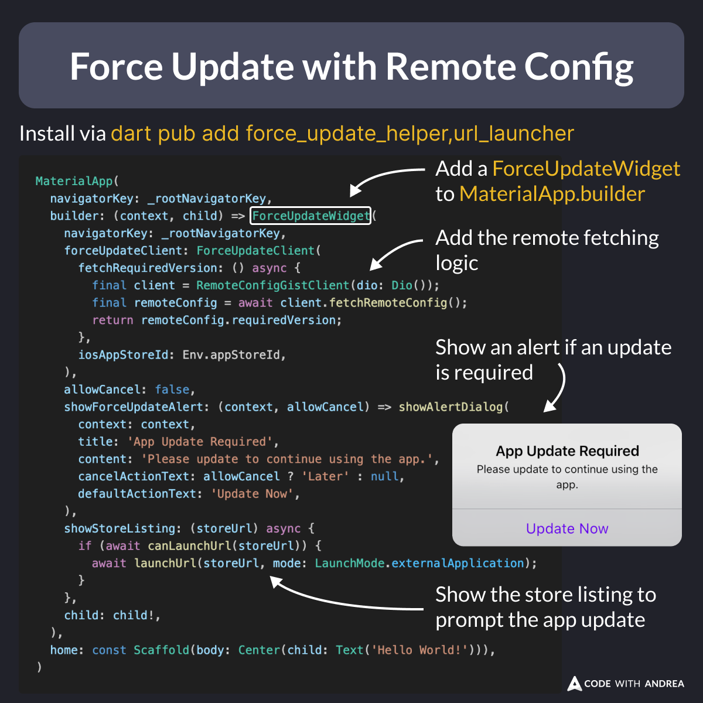

# Force Update with Remote Config

Ever needed a force update prompt that is controlled remotely?

There's a package for that: [force_update_helper](https://pub.dev/packages/force_update_helper).

This works by comparing the **current** app version with a **required** app version that is fetched from a remote source.

<!--
MaterialApp(
  navigatorKey: _rootNavigatorKey,
  builder: (context, child) => ForceUpdateWidget(
    navigatorKey: _rootNavigatorKey,
    forceUpdateClient: ForceUpdateClient(
      fetchRequiredVersion: () async {
        final client = RemoteConfigGistClient(dio: Dio());
        final remoteConfig = await client.fetchRemoteConfig();
        return remoteConfig.requiredVersion;
      },
      iosAppStoreId: Env.appStoreId,
    ),
    allowCancel: false,
    showForceUpdateAlert: (context, allowCancel) => showAlertDialog(
      context: context,
      title: 'App Update Required',
      content: 'Please update to continue using the app.',
      cancelActionText: allowCancel ? 'Later' : null,
      defaultActionText: 'Update Now',
    ),
    showStoreListing: (storeUrl) async {
      if (await canLaunchUrl(storeUrl)) {
        await launchUrl(storeUrl, mode: LaunchMode.externalApplication);
      }
    },
    child: child!,
  ),
  home: const Scaffold(),
)
-->

---

The package requires a bit of setup, and this is all documented in the README:

- [force_update_helper](https://pub.dev/packages/force_update_helper)

Example apps are also included, showing how to use a GitHub Gist or a Dart Shelf app as the remote source.

---

To learn more about force update and how to get your app ready for production, check out my latest course:

- [Flutter in Production](https://codewithandrea.com/courses/flutter-in-production/)

---

| Previous | Next |
| -------- | ---- |
| [Show the Licenses in your Flutter app](../0198-show-licenses-flutter-app/index.md) | [Fixing Build Issues - Nuclear Option 💣](../0200-fixing-build-issues-nuclear-option/index.md) |

<!-- TWITTER|https://x.com/biz84/status/1846119256045363411 -->
<!-- LINKEDIN|https://www.linkedin.com/posts/andreabizzotto_ever-needed-a-force-update-prompt-that-is-activity-7251885533587468288-ZfPg -->

