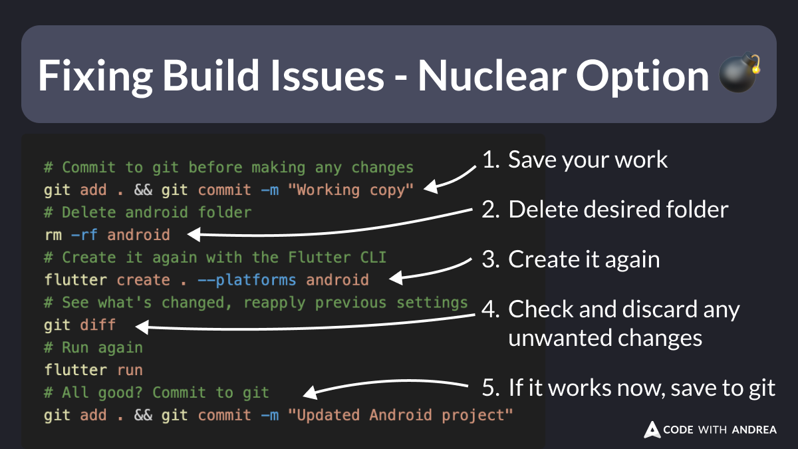

# Fixing Build Issues - Nuclear Option 💣

Did you know?

If you have a Flutter project that no longer builds on a specific platform, you can try this:

- delete the whole folder
- use the Flutter CLI to generate it again
- discard any unwanted changes

When it works, this can save you hours of frustration. 😌

<!--

# Commit to git before making any changes
git add . && git commit -m "Working copy"
# Delete android folder
rm -rf android
# Create it again with the Flutter CLI
flutter create . --platforms android
# See what's changed, reapply previous settings
git diff
# Run again
flutter run
# All good? Commit to git
git add . && git commit -m "Updated Android project"

-->

---

| Previous | Next |
| -------- | ---- |
| [Force Update with Remote Config](../0199-force-update-helper/index.md) |  |

<!-- TWITTER|https://x.com/biz84/status/1846459389252641100 -->
<!-- LINKEDIN|https://www.linkedin.com/posts/andreabizzotto_did-you-know-if-you-have-a-flutter-project-activity-7252225288271491072-QzCD -->

