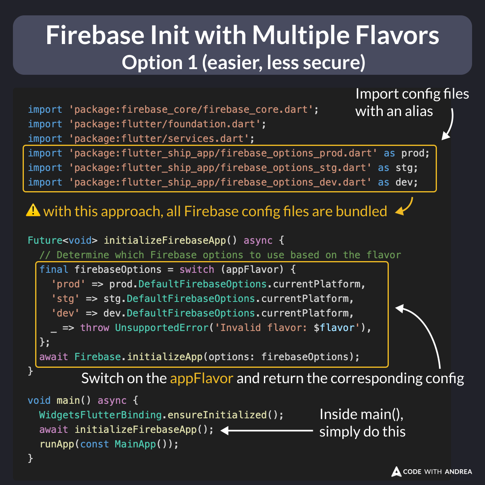
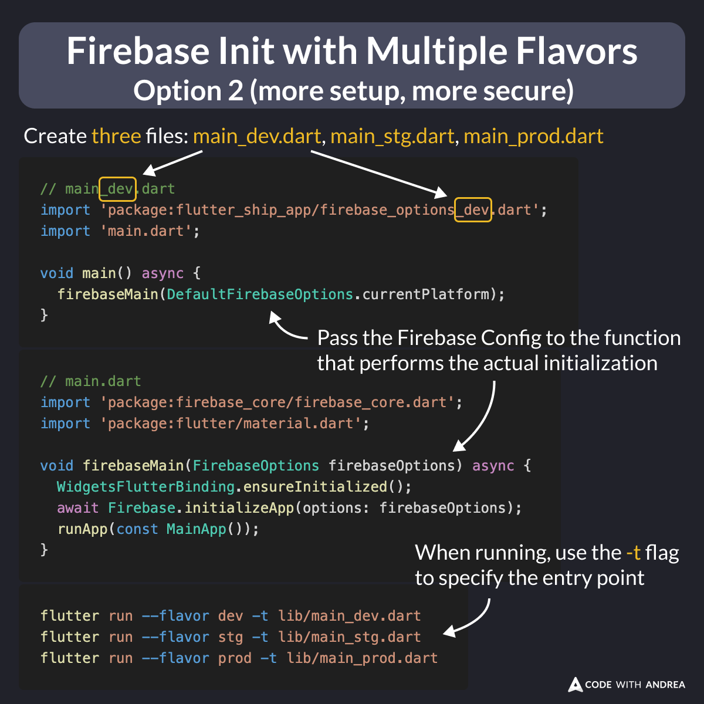

# Firebase Init with Multiple Flavors

Did you know?

If your Flutter app has multiple flavors, you can put all the Firebase initialization logic in one file and switch based on the [`appFlavor`](https://api.flutter.dev/flutter/services/appFlavor-constant.html).

When you do this, all the Firebase config files are bundled in the final app, which is not ideal.

<!--

import 'package:firebase_core/firebase_core.dart';
import 'package:flutter/foundation.dart';
import 'package:flutter/services.dart';
import 'package:flutter_ship_app/firebase_options_prod.dart' as prod;
import 'package:flutter_ship_app/firebase_options_stg.dart' as stg;
import 'package:flutter_ship_app/firebase_options_dev.dart' as dev;

Future<void> initializeFirebaseApp() async {
  // Determine which Firebase options to use based on the flavor
  final firebaseOptions = switch (appFlavor) {
    'prod' => prod.DefaultFirebaseOptions.currentPlatform,
    'stg' => stg.DefaultFirebaseOptions.currentPlatform,
    'dev' => dev.DefaultFirebaseOptions.currentPlatform,
    _ => throw UnsupportedError('Invalid flavor: $flavor'),
  };
  await Firebase.initializeApp(options: firebaseOptions);
}

void main() async {
  WidgetsFlutterBinding.ensureInitialized();
  await initializeFirebaseApp();
  runApp(const MainApp());
}

-->

---

A better solution is to create three entry points that load the corresponding config file and pass it to the function that performs the actual initialization.

When running, you can use the "-t" flag to specify the entry point.

This requires a bit more work but is more secure. 👍

<!--

// main_dev.dart
import 'package:flutter_ship_app/firebase_options_dev.dart';
import 'main.dart';

void main() async {
  firebaseMain(DefaultFirebaseOptions.currentPlatform);
}

// main.dart
import 'package:firebase_core/firebase_core.dart';
import 'package:flutter/material.dart';

void firebaseMain(FirebaseOptions firebaseOptions) async {
  WidgetsFlutterBinding.ensureInitialized();
  await Firebase.initializeApp(options: firebaseOptions);
  runApp(const MainApp());
}

// Run like this:
flutter run --flavor dev -t lib/main_dev.dart
flutter run --flavor stg -t lib/main_stg.dart
flutter run --flavor prod -t lib/main_prod.dart

-->

---

My latest course covers flavors and environments in great depth.

To learn more, check it out here:

- [Flutter in Production](https://codewithandrea.com/courses/flutter-in-production/)

---

| Previous | Next |
| -------- | ---- |
| [Fixing Build Issues - Nuclear Option 💣](../0200-fixing-build-issues-nuclear-option/index.md) | [What does flutter pub upgrade do?](../0202-flutter-pub-upgrade/index.md) |

<!-- TWITTER|https://x.com/biz84/status/1847236054828429628 -->
<!-- LINKEDIN|https://www.linkedin.com/posts/andreabizzotto_take-2-if-your-flutter-app-has-multiple-activity-7253002364234690560-MwsY -->

