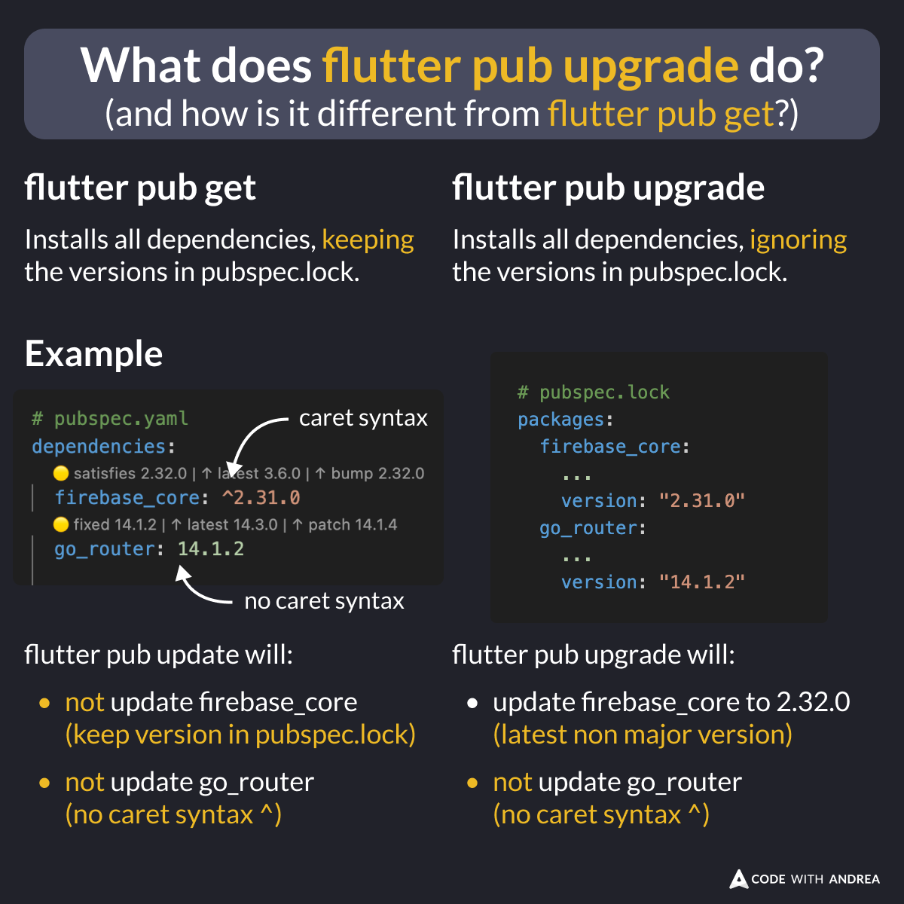

# What does flutter pub upgrade do?

Did you know?

There's a subtle difference between **pub get** and **pub upgrade**:

- **pub get** will get all dependencies, **keeping** the versions inside `pubspec.lock`.
- **pub upgrade** will upgrade all dependencies to the latest non-major version, **ignoring** the `pubspec.lock` file.

<!--

There's a subtle difference between "pub get" and "pub upgrade".

- "pub get" will get all dependencies, *keeping* the versions inside pubspec.lock.
- "pub upgrade" will upgrade all dependencies to the latest non-major version, *ignoring* the pubspec.lock file.

Neither command updates any dependencies that are locked to a specific version (no caret syntax).
-->

---

Also note:

- If `pubspec.lock` doesn't exist yet, both commands behave identically.
- Neither command updates any dependencies that are **locked** to a specific version (no caret syntax).

To learn more, read these resources:

- [Updating package dependencies](https://docs.flutter.dev/packages-and-plugins/using-packages#updating-package-dependencies)
- [dart pub upgrade](https://dart.dev/tools/pub/cmd/pub-upgrade)

---

| Previous | Next |
| -------- | ---- |
| [Firebase Init with Multiple Flavors](../0201-firebase-init-multiple-flavors/index.md) |  |

<!-- TWITTER|https://x.com/biz84/status/1848646896170000843 -->
<!-- LINKEDIN|https://www.linkedin.com/posts/andreabizzotto_did-you-know-theres-a-subtle-difference-activity-7254412930966810625-HBID -->

