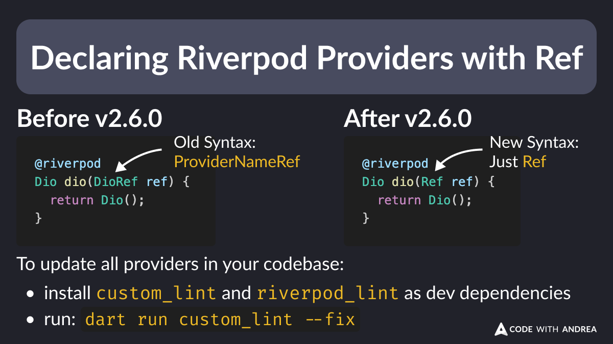

# Declaring Riverpod Providers with Ref

Did you know?

Since Riverpod 2.6.0, all generated providers can be declared with a `Ref` argument.

The old `[ProviderName]Ref` syntax is deprecated.

To upgrade existing projects, simply run: `dart run custom_lint --fix`. 👍



<!--

// Old syntax (before v2.6.0)
@riverpod
Dio dio(DioRef ref) {
  return Dio();
}

// New syntax (after v2.6.0)
@riverpod
Dio dio(Ref ref) {
  return Dio();
}

// To update all providers in your codebase:
// - install custom_lint and riverpod_lint as dev dependencies
// - run `dart run custom_lint --fix`

-->

---

**Note**: in order to update all providers in your codebase, `custom_lint` needs to be installed and configured:

```yaml
# pubspec.yaml
dev_dependencies:
  custom_lint: 0.7.0
  riverpod_lint: 2.6.2
```  

```yaml
# analysis_options.yaml
analyzer:
  plugins:
    - custom_lint
```

Once this is done, run: `dart run custom_lint --fix`.

---

| Previous | Next |
| -------- | ---- |
| [What does flutter pub upgrade do?](../0202-flutter-pub-upgrade/index.md) |  |

<!-- TWITTER|https://x.com/biz84/status/1853474061638099311 -->
<!-- LINKEDIN|https://www.linkedin.com/posts/andreabizzotto_did-you-know-since-riverpod-260-all-activity-7259240043548938241-GHBi -->

