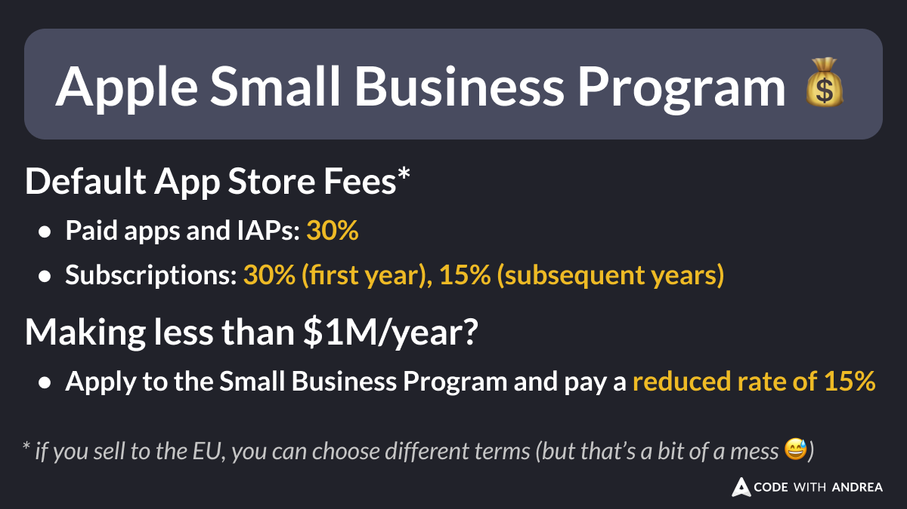

# Apple Small Business Program

Did you know?

If you sell apps on the iOS App Store, Apple will take a big cut:
- paid apps & IAPs: 30%
- subscriptions: 30% in the first year, 15% after
 
But if you make less than $1M/year, you can apply to the Small Business Program and slash your fees to 15%!

That's a no-brainer 💰

<!--

Apple Small Business Programm

Default App Store Fees:
- Paid apps and IAPs: 30%
- Subscriptions: 30% (first year), 15% (subsequent years)

Making less than $1M/year?

- Apply to the Small Business program and pay a reduced rate of 15%

* if you sell to the EU, you can choose different terms (but that’s a bit of a mess 😅)
-->

---

Read this page to learn more and enroll:

- [Apple Small Business Program](https://developer.apple.com/app-store/small-business-program/)

---

| Previous | Next |
| -------- | ---- |
| [Declaring Riverpod Providers with Ref](../0203-riverpod-prodivers-with-ref/index.md) |  |

<!-- TWITTER|https://x.com/biz84/status/1854534361841823907 -->
<!-- LINKEDIN|https://www.linkedin.com/posts/andreabizzotto_did-you-know-if-you-sell-apps-on-the-ios-activity-7260300383128797185-DfeQ/ -->
<!-- BLUESKY|https://bsky.app/profile/codewithandrea.com/post/3laeiswogmc2w -->