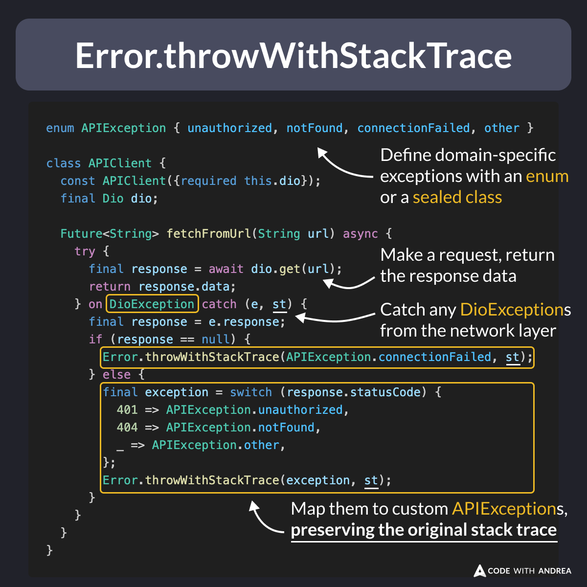

# Error.throwWithStackTrace

Did you know?

Using domain-specific exceptions makes your code easier to test and maintain.

But don’t lose the original stack trace for debugging!

With `Error.throwWithStackTrace`, you can throw custom exceptions while keeping the original stack trace intact. 👇

<!--

enum APIException { unauthorized, notFound, connectionFailed, other }

class APIClient {
  const APIClient({required this.dio});
  final Dio dio;

  Future<String> fetchFromUrl(String url) async {
    try {
      final response = await dio.get(url);
      return response.data;
    } on DioException catch (e, st) {
      final response = e.response;
      if (response == null) {
        Error.throwWithStackTrace(APIException.connectionFailed, st);
      } else {
        final exception = switch (response.statusCode) {
          401 => APIException.unauthorized,
          404 => APIException.notFound,
          _ => APIException.other,
        };
        Error.throwWithStackTrace(exception, st);
      }
    }
  }
}

-->

---

To learn more, read the official docs:

- [Error.throwWithStackTrace](https://api.flutter.dev/flutter/dart-core/Error/throwWithStackTrace.html)

---

| Previous | Next |
| -------- | ---- |
| [Apple Small Business Program](../0204-apple-small-business-program/index.md) | |

<!-- TWITTER|https://x.com/biz84/status/1856346045069787263 -->
<!-- LINKENIN|https://www.linkedin.com/posts/andreabizzotto_did-you-know-using-domain-specific-exceptions-activity-7262112040121520130-3pfy -->
<!-- BLUESKY|https://bsky.app/profile/codewithandrea.com/post/3lar2vx6s522y -->
