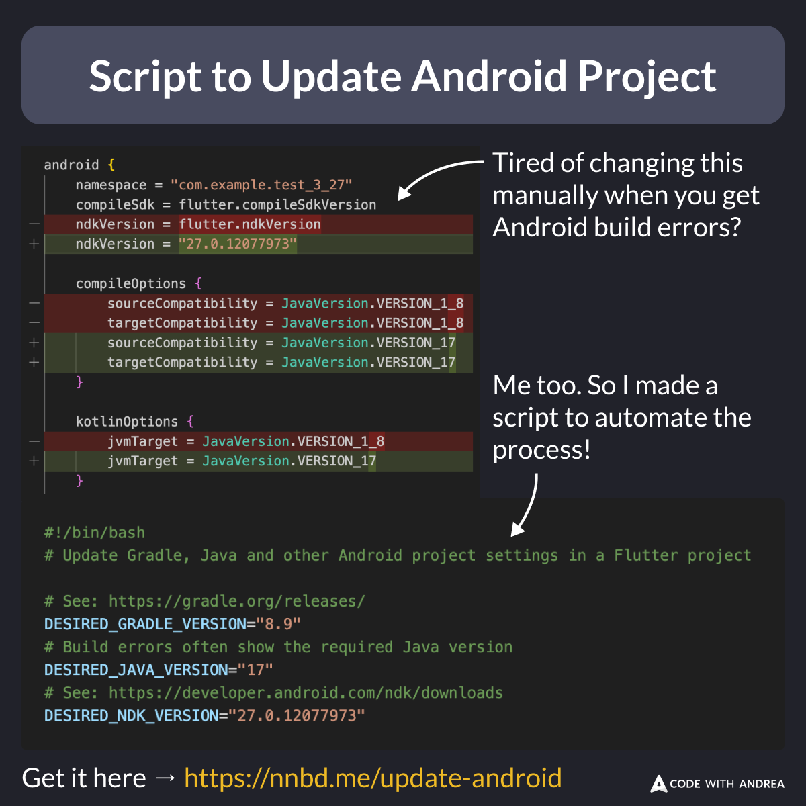

# Script to Update the Android Project Settings

Tired of dealing with Gradle and other build errors on Android? 🤮

Me too! So, I built a script to fix it all at once:

- Gradle version
- Java version
- NDK version
- Min SDK
- Target SDK

The result? Faster updates and fewer headaches. 👍

<!--
Tired of doing this manually?

  android {
    namespace = "com.example.test_3_27"
    compileSdk = flutter.compileSdkVersion
-   ndkVersion = flutter.ndkVersion
+   ndkVersion = "27.0.12077973"

    compileOptions {
-       sourceCompatibility = JavaVersion.VERSION_1_8
+       sourceCompatibility = JavaVersion.VERSION_17
-       targetCompatibility = JavaVersion.VERSION_1_8
+       targetCompatibility = JavaVersion.VERSION_17
    }

    kotlinOptions {
-       jvmTarget = JavaVersion.VERSION_1_8
+       jvmTarget = JavaVersion.VERSION_17
    }
    ...
}

# Script to update Gradle, Java and other Android project settings in a Flutter project

# See: https://gradle.org/releases/
DESIRED_GRADLE_VERSION="8.9"
# Build errors often show the required Java version
DESIRED_JAVA_VERSION="17"
# See: https://developer.android.com/ndk/downloads
DESIRED_NDK_VERSION="27.0.12077973"

-->

---

You can grab the script here:

- [Script to update Gradle, Java and other Android project settings in a Flutter project](https://gist.github.com/bizz84/605e2ca2088cb4acb7a076ca993f41cd)

To use it:

- Download the script and add it to a folder in your system PATH
- Give it execution access: `chmod +x update-android-project.sh`
- Tweak the versions if needed
- Run it from the root of your Flutter project

---

⚠️ Heads up: The script may not work perfectly for older Android projects.

If your Android project is very old, the best fix is to nuke it and create it again with the Flutter CLI, as described here:

- [Fixing Build Issues - Nuclear Option](https://codewithandrea.com/tips/fixing-build-issues-nuclear-option/)

---

| Previous | Next |
| -------- | ---- |
| [Error.throwWithStackTrace](../0205-throw-error-with-stack-trace/index.md) | [Downloads Count on pub.dev](../0207-downloads-count-pub-dev/index.md) |

<!-- TWITTER|https://x.com/biz84/status/1858451367959855404 -->
<!-- LINKEDIN|https://www.linkedin.com/posts/andreabizzotto_tired-of-dealing-with-gradle-and-other-build-activity-7264217587473911808-skOn -->
<!-- BLUESKY|https://bsky.app/profile/codewithandrea.com/post/3lb7ohh4coc2k -->
