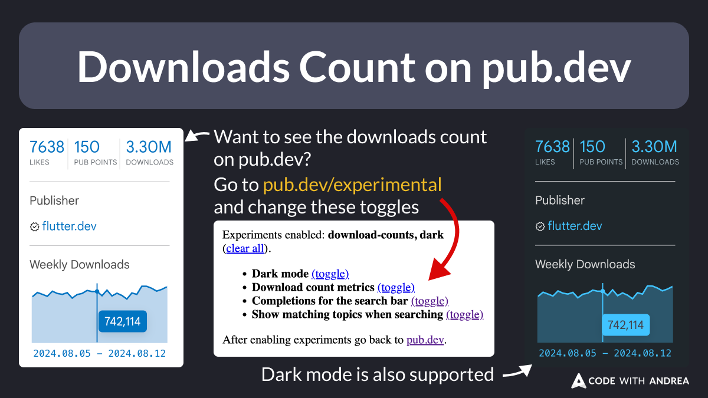

# Downloads Count on pub.dev

Did you know?

You can now see the downloads count for your favourite packages on pub.dev.

To enable this, go to [pub.dev/experimental](https://pub.dev/experimental), and toggle "Download count metrics".

Dark mode is also supported. 🌚

<!--

Want to see the downloads count on pub.dev?

Go to pub.dev/experimental and change the toggles as needed.

Dark mode is also supported.

-->

---

| Previous | Next |
| -------- | ---- |
| [Script to Update the Android Project Settings](../0206-update-android-project/index.md) | |

<!-- TWITTER|https://x.com/biz84/status/1859569027045089661 -->
<!-- LINKEDIN|https://www.linkedin.com/posts/andreabizzotto_did-you-know-you-can-now-see-the-downloads-activity-7265335006363889664-yKdp -->
<!-- BLUESKY|https://bsky.app/profile/codewithandrea.com/post/3lbhgjp42zs2q -->