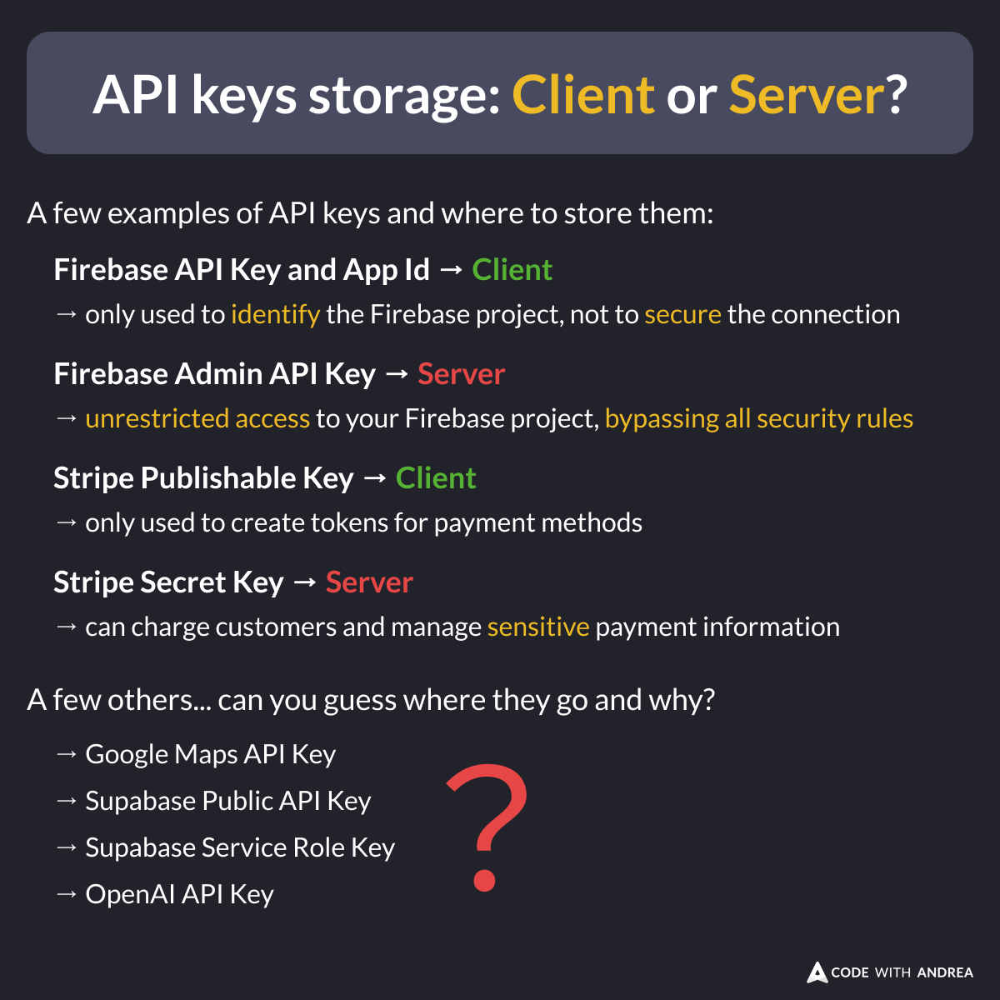

# API keys storage: Client or Server?

When building mobile or web apps, security is paramount.

Some API keys belong on the client, others on the server—but do you know which is which? 🤔

Here are some guidelines to help you decide.

<!--

API keys storage: Client or Server?

A few examples of API keys and where to store them:

Firebase API Key and App Id → Client
→ only used to identify the Firebase project, not to secure the connection

Firebase Admin API Key → Server
→ unrestricted access to your Firebase project, bypassing all security rules

Stripe Publishable Key → Client
→ only used to create tokens for payment methods

Stripe Secret Key → Server
→ can charge customers and manage sensitive payment information

A few others... can you guess where they go and why?
→ Google Maps API Key
→ Supabase Public API Key
→ Supabase Service Role Key
→ OpenAI API Key

-->

### Additional Resources

For more in-depth guidance about securing API keys, read this article:

- [How to Store API Keys in Flutter: --dart-define vs .env files](https://codewithandrea.com/articles/flutter-api-keys-dart-define-env-files/)

---

Some API keys must be stored on the server and never transmitted to the client. Dart Shelf works great in this scenario, and this article covers all the details:

- [How to Build and Deploy a Dart Shelf App on Globe.dev](https://codewithandrea.com/articles/build-deploy-dart-shelf-app-globe/)

---

If you work with Firebase Cloud Functions and want to learn about best practices for securing your server-side keys, this guide has you covered:

- [How to Secure API Keys with 2nd-Gen Cloud Functions and Firebase](https://codewithandrea.com/articles/api-keys-2ndgen-cloud-functions-firebase/)

---

| Previous | Next |
| -------- | ---- |
| [Downloads Count on pub.dev](../0207-downloads-count-pub-dev/index.md) | [iOS App Store: Build and Upload Script](../0209-build-upload-ios-script/index.md) |

<!-- TWITTER|https://x.com/biz84/status/1861074917917073843 -->
<!-- LINKEDIN|https://www.linkedin.com/posts/andreabizzotto_when-building-mobile-or-web-apps-security-activity-7266842729458851840-JuGi -->
<!-- BLUESKY|https://bsky.app/profile/codewithandrea.com/post/3lbrv7hm3mk2v -->