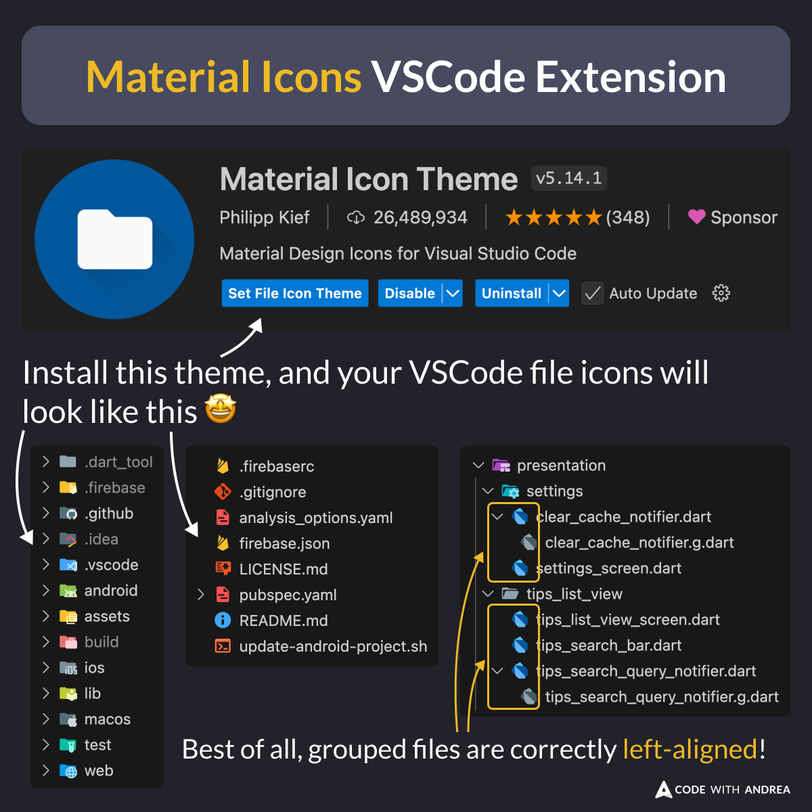

# Material Icons Theme (VSCode Extension)

Tired of the old, boring VSCode default theme?

Then, install the [Material Icons Theme](https://marketplace.visualstudio.com/items?itemName=PKief.material-icon-theme) and upgrade all your file icons! 🤩

File nesting is properly supported, too, and the icons will be correctly left-aligned! 🎉

<!--

Material Icon Theme VSCode Extension

Install this theme, and your VSCode file icons will look as shown in the preview screenshots.

Best of all, grouped files are correcty left-aligned!

-->

---

| Previous | Next |
| -------- | ---- |
| [iOS App Store: Build and Upload Script](../0209-build-upload-ios-script/index.md) | [Fix for Missing Compliance Warning in App Store Connect](../0211-fix-missing-compliance-warning/index.md) |

---

<!-- TWITTER|https://x.com/biz84/status/1861698580727075132 -->
<!-- LINKEDIN|https://www.linkedin.com/posts/andreabizzotto_tired-of-the-old-boring-vscode-default-theme-activity-7267464786907389952-w42m -->
<!-- BLUESKY|https://bsky.app/profile/codewithandrea.com/post/3lbw7cepvg22v -->
