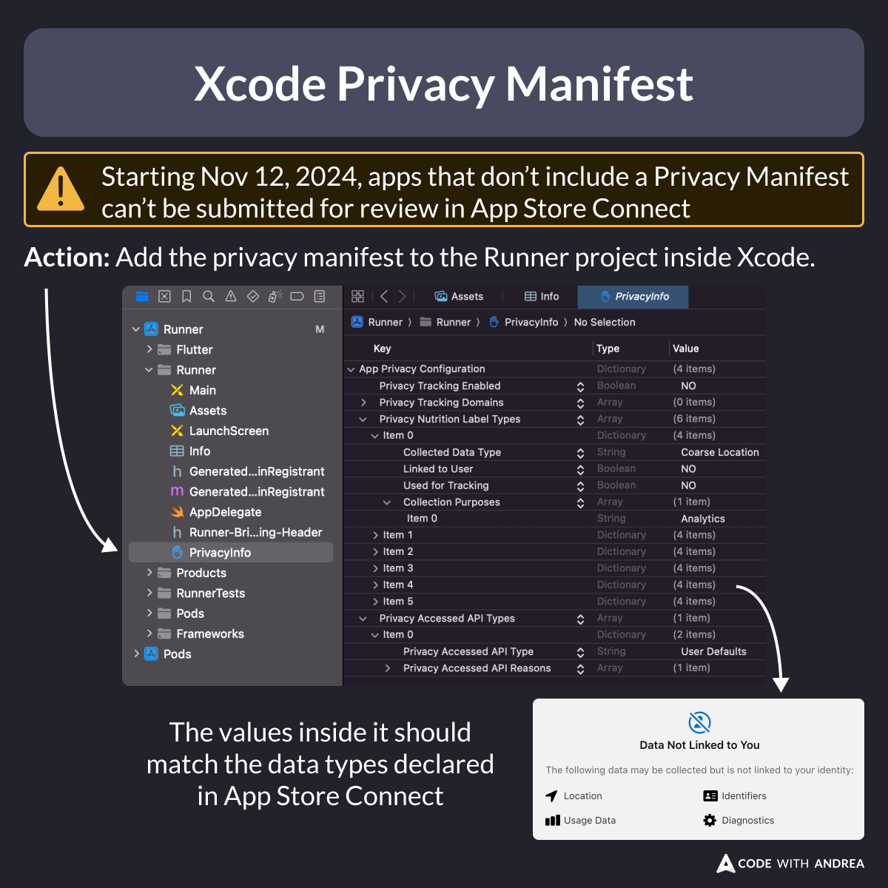

# Adding a Privacy Manifest in Xcode

Did you know?

Starting November 12, 2024, apps that don’t include a Privacy Manifest can’t be submitted for review in App Store Connect.

To address this, add a privacy manifest to the Runner project inside Xcode.

See below for more info about what to put inside it. 🧵

<!--

Xcode Privacy Manifest

Warning: Starting Nov 12, 2024, apps that don’t include a Privacy Manifest can’t be submitted for review in App Store Connect.

Action: Add the privacy manifest to the Runner project inside Xcode.

The values inside it should match data types declared in App Store Connect.

-->

---

To learn more, read:

- [Adding a privacy manifest to your app or third-party SDK](https://developer.apple.com/documentation/bundleresources/adding-a-privacy-manifest-to-your-app-or-third-party-sdk)

For instructions about what to put in your privacy manifest, read:

- [Privacy manifest files](https://developer.apple.com/documentation/bundleresources/privacy-manifest-files)

---

My latest course covers the iOS release process in depth, including:

✅ Enroll in the Apple Developer Program
✅ Create apps in App Store Connect
✅ Prepare for review
✅ Xcode project settings
✅ Build, upload & submit

Check it out for all the details:

- [Flutter in Production](https://codewithandrea.com/courses/flutter-in-production/)

---

| Previous | Next |
| -------- | ---- |
| [Fix for Missing Compliance Warning in App Store Connect](../0211-fix-missing-compliance-warning/index.md) | |

<!-- TWITTER|https://x.com/biz84/status/1863537508899860770 -->
<!-- LINKEDIN|https://www.linkedin.com/posts/andreabizzotto_did-you-know-starting-november-12-2024-activity-7269303842813489154-k5iw -->
<!-- BLUESKY|https://bsky.app/profile/codewithandrea.com/post/3lccxnqg5zs2j -->
