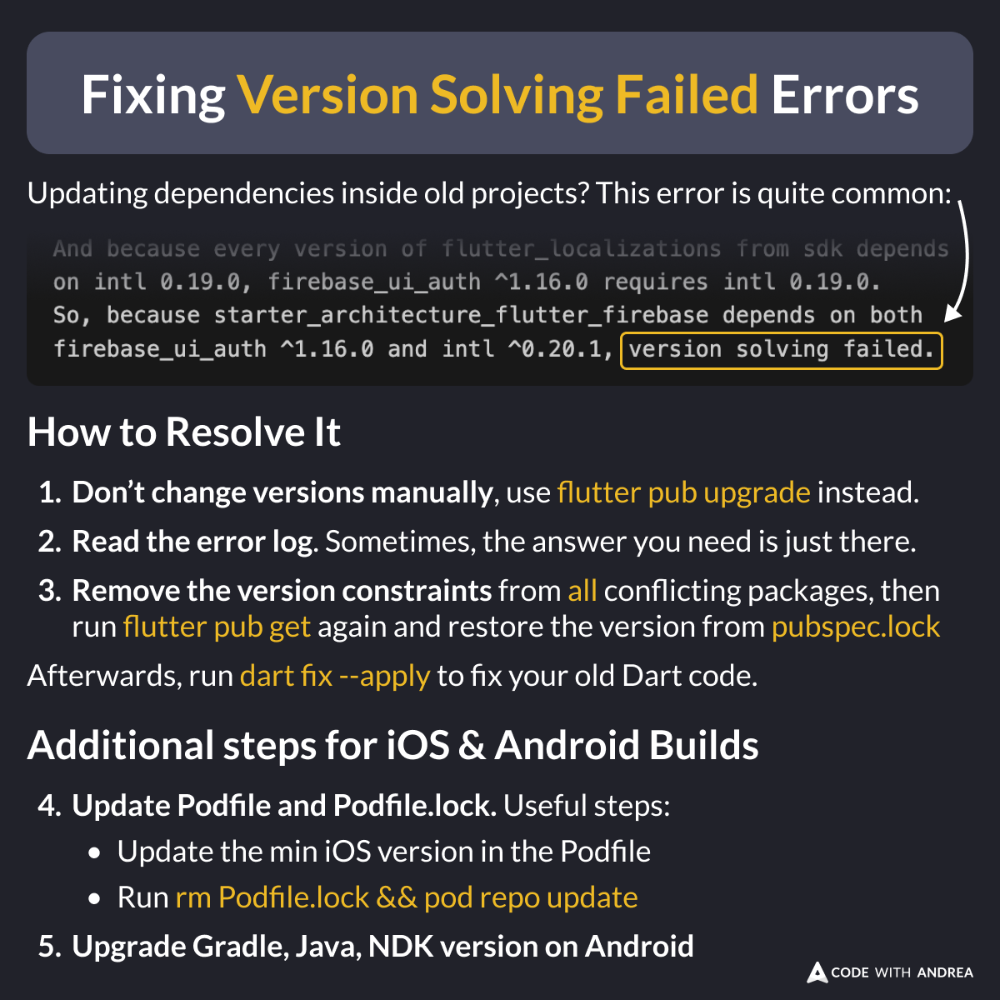
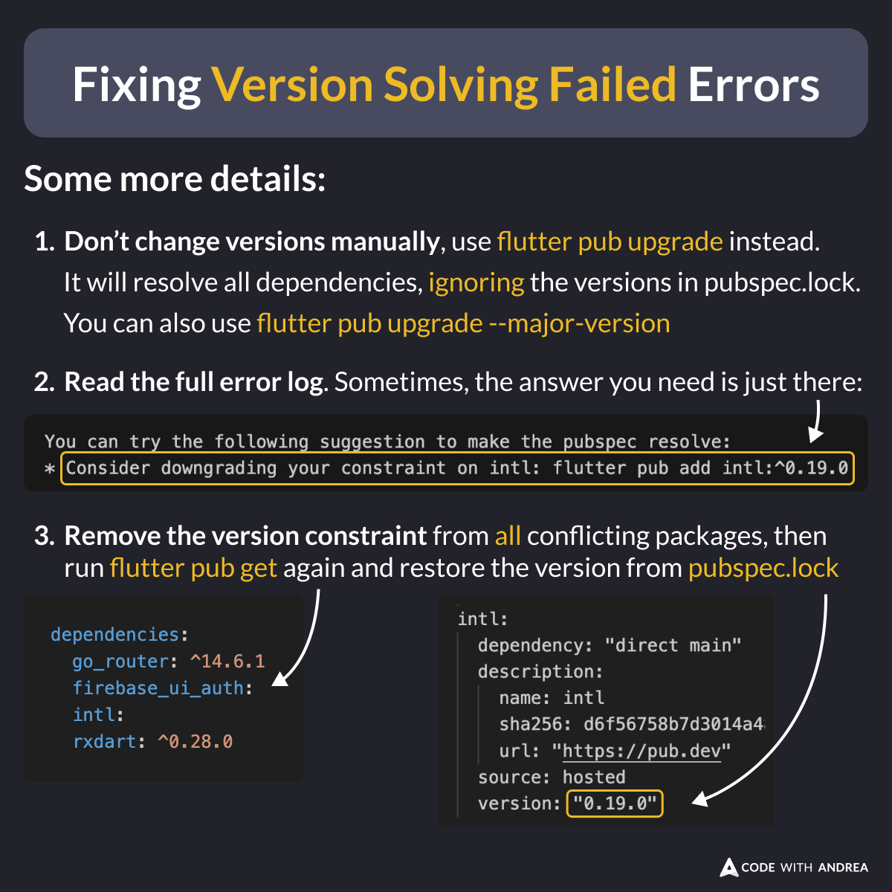

# Fixing Version Solving Failed Errors

When you get a "version solving failed" error, how can you fix it?

Some useful tips:

1. Use `flutter pub upgrade`, don't change versions manually 💡
2. Read the error logs 🧐
3. Remove all version constraints 👻
4. Update your Podfile 🍏
5. Update the Android project settings 🤖

<!--
Updating dependencies inside old projects? The "version solving failed" error is quite common.

How to Resolve It

1. Don’t change versions manually, use flutter pub upgrade instead.
2. Read the error log. Sometimes, the answer you need is just there.
3. Remove the version constraints from all conflicting packages, then run flutter pub get again and restore the version from pubspec.lock

Afterwards, run dart fix --apply to fix your old Dart code.

Additional steps for iOS & Android Builds

4. Update Podfile and Podfile.lock. Useful steps:
- Update the min iOS version in the Podfile
- Run rm Podfile.lock && pod repo update
5. Upgrade Gradle, Java, NDK version on Android

-->

---

Some more details:

1. `flutter pub upgrade` is your friend. It will try to resolve all dependencies without causing conflicts
2. Be persistent. Inspect the error log closely and see if you can figure it out
3. Remove version constraints from conflicting packages and try again

<!--
Some more details:

1. Don’t change versions manually, use flutter pub upgrade instead. It will resolve all dependencies, ignoring the versions in pubspec.lock. You can also use flutter pub upgrade --major-version.

2. Read the full error log. Sometimes, the answer you need is just there.

3. Remove the version constraint from all conflicting packages, then run flutter pub get again and restore the version from pubspec.lock

-->

---

Here's some more info about the `flutter pub upgrade` command:

- [What does flutter pub upgrade do?](https://codewithandrea.com/tips/flutter-pub-upgrade/)

---

If you need to update the Android project settings, this script may help:

- [Script to Update the Android Project Settings](https://codewithandrea.com/tips/update-android-project-script/)

---

| Previous | Next |
| -------- | ---- |
| [Adding a Privacy Manifest in Xcode](../0212-xcode-privact-manifest/index.md) | [Improve your code with Cursor Edit Mode](../0214-cursor-edit-mode/index.md) |

<!-- TWITTER|https://x.com/biz84/status/1864283511852527815 -->
<!-- LINKEDIN|https://www.linkedin.com/posts/andreabizzotto_when-you-get-a-version-solving-failed-error-activity-7270050610329100289-0I9m -->
<!-- BLUESKY|https://bsky.app/profile/codewithandrea.com/post/3lci5gzmagc27 -->

