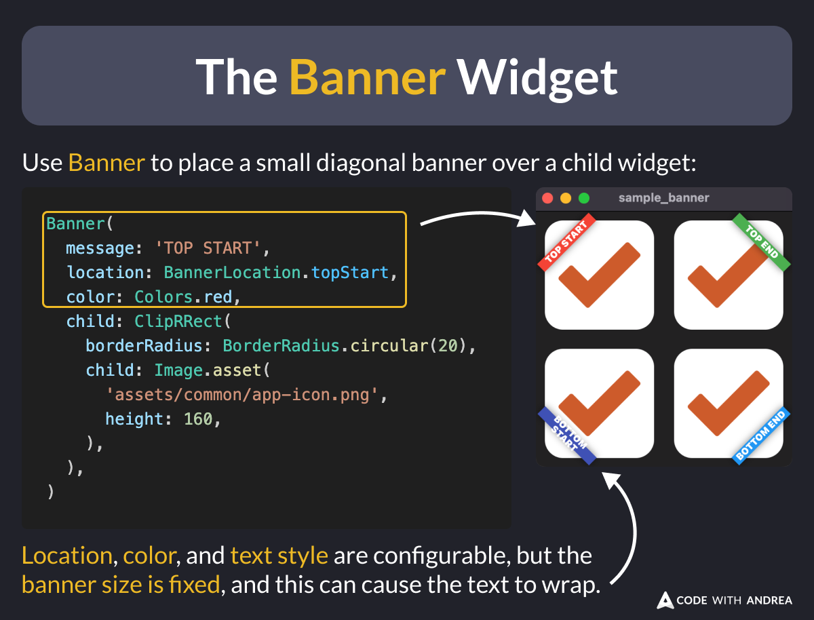

# The Banner Widget

Did you know?

You can use the [Banner](https://api.flutter.dev/flutter/widgets/Banner-class.html) widget to place a small diagonal banner over a child widget.

<!-- 
// Use Banner to place a small diagonal banner over a child widget
Banner(
  message: 'TOP START',
  location: BannerLocation.topStart,
  color: Colors.red,
  child: ClipRRect(
    borderRadius: BorderRadius.circular(20),
    child: Image.asset(
      'assets/common/app-icon.png',
      height: 160,
    ),
  ),
)
// Location, color, and text style are configurable, but the banner size is fixed, and this can cause the text to wrap.
-->

Note that `Banner` only offers limited customization options. If you need more custom styling, you have two options:

- Build your own using a custom painter.
- Use the [super\_banners](https://pub.dev/packages/super_banners) package.

---

`Banner` is very closely related to [CheckedModeBanner](https://api.flutter.dev/flutter/widgets/Banner-class.html), which shows inside your `MaterialApp` in debug mode. For more info, check the official docs: [Banner class](https://api.flutter.dev/flutter/widgets/Banner-class.html).

---

| Previous | Next |
| -------- | ---- |
| [Improve your code with Cursor Edit Mode](../0214-cursor-edit-mode/index.md) | [New Spacing Argument in Row/Column (Flutter 3.27)](../0216-spacing-row-column/index.md) |

<!-- TWITTER|https://x.com/biz84/status/1866482324105490628 -->
<!-- LINKEDIN|https://www.linkedin.com/posts/andreabizzotto_did-you-know-you-can-use-the-banner-widget-activity-7272248288236519424-tfzF -->
<!-- BLUESKY|https://bsky.app/profile/codewithandrea.com/post/3lcxfixclys2f -->