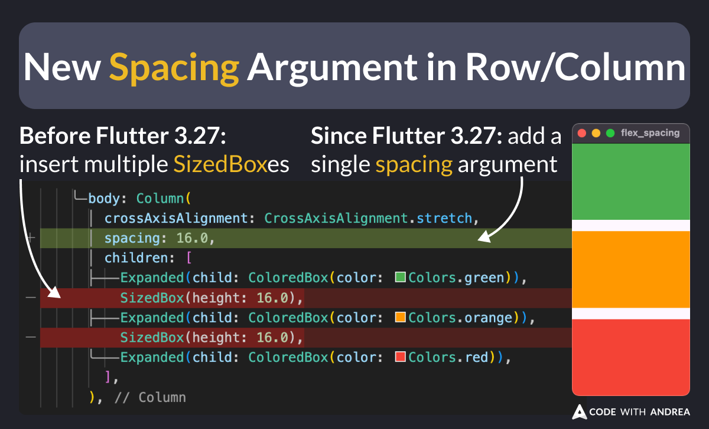
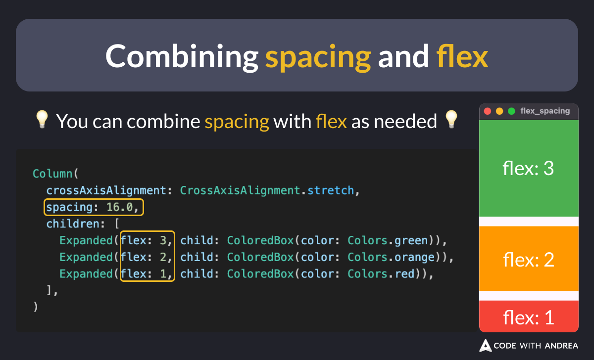

# New Spacing Argument in Row/Column (Flutter 3.27)

Did you know?

Since Flutter 3.27, you can pass a `spacing` argument to your `Row` and `Column` widgets. ✅

This means you no longer need a `SizedBox` to add fixed spacing between each child. 🚀

<!--

// New Spacing Argument in Row/Column

// Before Flutter 3.27
Column(
  crossAxisAlignment: CrossAxisAlignment.stretch,
  children: [
    Expanded(child: ColoredBox(color: Colors.green)),
    SizedBox(height: 16.0),
    Expanded(child: ColoredBox(color: Colors.orange)),
    SizedBox(height: 16.0),
    Expanded(child: ColoredBox(color: Colors.red)),
  ],
)

// Since Flutter 3.27
Column(
  crossAxisAlignment: CrossAxisAlignment.stretch,
  spacing: 16.0,
  children: [
    Expanded(child: ColoredBox(color: Colors.green)),
    Expanded(child: ColoredBox(color: Colors.orange)),
    Expanded(child: ColoredBox(color: Colors.red)),
  ],
)

-->

---

If you want, you can combine spacing and flex together.

This makes it easier to mix **fixed** and **proportional** spacing when laying out the children.

<!--

// Combining spacing and flex

// You can combine spacing with flex as needed:
Column(
  crossAxisAlignment: CrossAxisAlignment.stretch,
  spacing: 16.0,
  children: [
    Expanded(flex: 3, child: ColoredBox(color: Colors.green)),
    Expanded(flex: 2, child: ColoredBox(color: Colors.orange)),
    Expanded(flex: 1, child: ColoredBox(color: Colors.red)),
  ],
)

-->

<!-- TWITTER|https://x.com/biz84/status/1867143273652904039 -->
<!-- LINKEDIN|https://www.linkedin.com/posts/andreabizzotto_did-you-know-since-flutter-327-you-can-activity-7272909542131187712-7Spj -->
<!-- BLUESKY|https://bsky.app/profile/codewithandrea.com/post/3ld3ycpuxxk2f -->

---

| Previous | Next |
| -------- | ---- |
| [The Banner Widget](../0216-spacing-row-column/index.md) | |