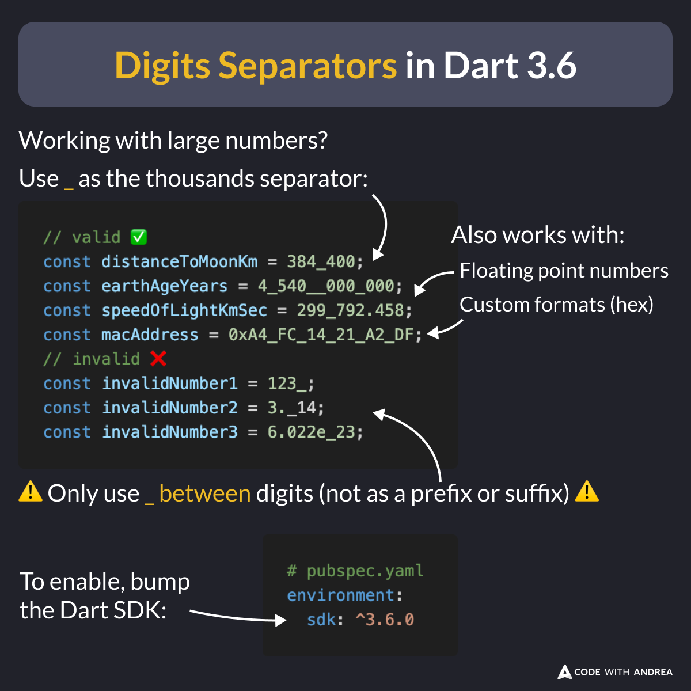

# Digits Separators in Dart 3.6

Did you know?

Since Dart 3.6 (Flutter 3.27), you can use `_` as a digits separator. 🎯

This works with integers and floats, as well as custom formats (hex, scientific).

To enable this, bump the Dart SDK to 3.6 in your `pubspec.yaml`.

<!--

// valid ✅
const distanceToMoonKm = 384_400;
const earthAgeYears = 4_540__000_000;
const speedOfLightKmSec = 299_792.458;
const macAddress = 0xA4_FC_14_21_A2_DF;
// invalid ❌
const invalidNumber1 = 123_;
const invalidNumber2 = 3._14;
const invalidNumber3 = 6.022e_23;

-->

---

| Previous | Next |
| -------- | ---- |
| [New Spacing Argument in Row/Column (Flutter 3.27)](../0216-spacing-row-column/index.md) | |

<!-- TWITTER|https://x.com/biz84/status/1867505284002000962 -->
<!-- LINKEDIN|https://www.linkedin.com/posts/andreabizzotto_did-you-know-since-dart-36-flutter-327-activity-7273271119049068544-gQuB -->
<!-- BLUESKY|https://bsky.app/profile/codewithandrea.com/post/3ld6ioxq5x22f -->