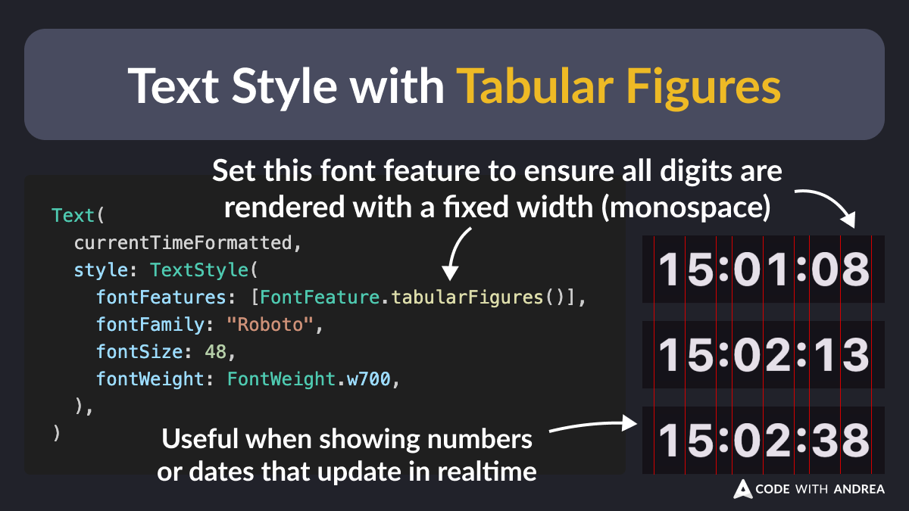

# Text Style with Tabular Figures

Did you know?

If you want to render fixed width (monospaced) digits, set FontFeature.tabularFigures() inside your TextStyle. 🎯

This works great when showing numbers and dates that should align vertically or update in realtime! 🔥

<!--

Text(
  currentTimeFormatted,
  style: const TextStyle(
    // Set this font feature to ensure all digits are rendered with a fixed width (monospace)
    // Useful when showing numbers or dates that update in realtime
    fontFeatures: [FontFeature.tabularFigures()],
    fontFamily: "Roboto",
    fontSize: 48,
    fontWeight: FontWeight.w700,
  ),
)

-->

---

| Previous | Next |
| -------- | ---- |
| [Digits Separators in Dart 3.6](../0217-digits-separators/index.md) | |

<!-- TWITTER|https://x.com/biz84/status/1868692579648487611 -->
<!-- LINKEDIN|https://www.linkedin.com/posts/andreabizzotto_did-you-know-if-you-want-to-render-fixed-activity-7274458459914350593-YkSx -->
<!-- BLUESKY|https://bsky.app/profile/codewithandrea.com/post/3ldgqe64qzs24 -->